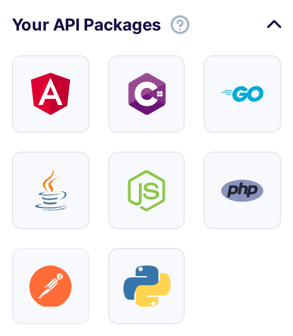

title: Client libraries and SDKs
description: Flotiq provides SDKs, or client libraries, to access your Content, but if you would like to build your own - you can use the OpenAPI compatible schema to generate clients and servers for multiple languages.

# Generating SDKs

## Download a package for your language

On your Flotiq dashboard, you can find links to download client libraries (SDK packages) for several frameworks and languages.



Currently supported generators are:

* C# client,
* Go client,
* Java client,
* Node client,
* PHP client,
* Python client,
* Angular client,
* Postman collection.
 
These packages are automatically generated every time you modify your Content Type definitions, just like your API documentation.

## Generate server libraries or clients for other languages

If you need more control over how the packages are generated or if you'd like to generate a server package instead - it's fairly easy to do using [OpenAPI generator](https://openapi-generator.tech).
Flotiq always provides your up-to-date API definition in an OpenAPI 3.0 compatible schema, read [how to find your Flotiq OpenAPI schema](../open-api-schema/). 


``` shell
npm install @openapitools/openapi-generator-cli@cli-4.2.3 -g
```
{ data-search-exclude }


This will install the OpenAPI generator that will allow you to generate more packages. List of supported generators is mentioned on the [OpenAPI generator page](https://openapi-generator.tech/docs/generators).

```
openapi-generator generate -g <name> -i <path_to_open_api_schema_json> --skip-validate-spec -o <output_path>
```
{ data-search-exclude }

Parameters description:

* `<name>` - name of framework/language you want to generate package for (ex. typescript-angular)
* `<path_to_open_api_schema_json>` - path to generated OpenApiSchema file.
* `<output_path>` - specify where you want to output your generated package   

## Use Swagger Editor to generate server and client libraries

Alternatively, you can go to [Swagger Editor](https://editor.swagger.io), paste the contents of you open-api-schema.json file there and generate a package that you are interested in.
