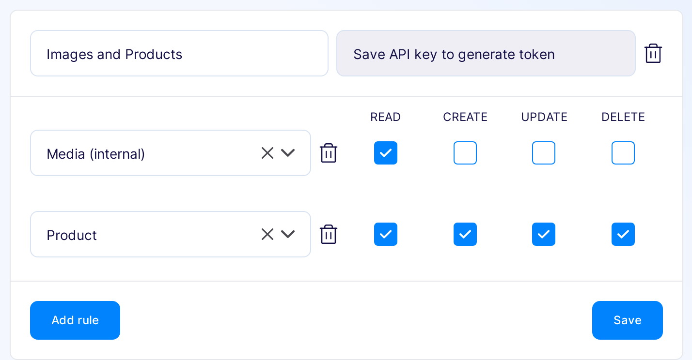
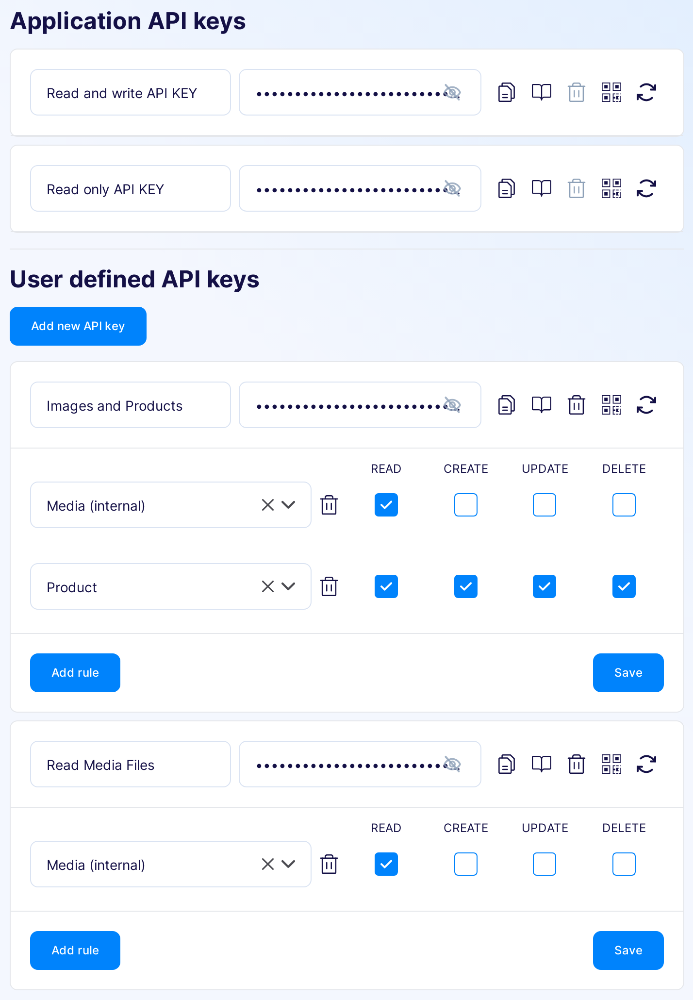

# API access

All API endpoints that are published in Flotiq are currently using an API-key authorization method. 

There are two types of API keys - [Application Keys](#application-api-keys) and [User Defined Keys](#user-defined-api-keys). Both types of keys can be retrieved from the API Keys page in the Flotiq Panel (click on your avatar to open the menu):

{: .center .border}

All keys restrict access to not only CRUD of the Content Objects, but also to their hydration and search; the same restrictions apply to GraphQL endpoint.

!!! note 
    _**Keys CAN NOT be obtained through programmatic API, and they are accessible only from the Flotiq Panel.**_

## Application API Keys

Every Flotiq account has 2 Application API keys - read-write and read-only. Application keys are system-wide keys, and you can use them to manage all of your Content Objects and Content Type Definitions. Please note, that for most applications you should create User Defined API keys - scoped to a particular set of Content Types and permissions.

{: .center .width75 .border}

All keys can be copied using {: style="margin-bottom: -7px;"} button. 
You can open QR code with the key using {: style="margin-bottom: -7px;"} button, 
and you can regenerate keys using {: style="margin-bottom: -7px;"} button. 
Only user defined keys can be removed using {: style="margin-bottom: -7px;"} button.

!!! hint
    You can use the QR code of your API keys to authorize your Flotiq Mobile Expo installation to access your data. Head over to the [Flotiq Mobile Expo repository](https://github.com/flotiq/flotiq-mobile-demo) to learn more.

## User Defined API Keys :fontawesome-solid-exclamation-triangle:{ .pricing-info title="Limits apply" }[^1]

{: .center .width75 .border}

You can add your own API keys restricted to specific Content Objects (e.g. Media) and actions (create, read, update, delete). 

{: .center .width75 .border}

You can also mix and match access to any Content Objects from your account, to add new access rule for CO, click "Add Rule" button. When the key is complete, don't forget to save it using the "Save" button. 

{: .center .width75 .border}

Every key has to be saved separately.

To restrict access for already used keys you can remove all rules or remove the key. You can regenerate keys if you suspect somebody unauthorized had access to them.

And here you can see how it looks all in the User Interface:

{: .center .width75 .border}

## Usage

You can authenticate your requests by `X-AUTH-TOKEN` header, or by the query part of the request url: `?auth_token=YOUR_API_TOKEN`.

## Frequently Asked Questions

### What can I do if my API key got compromised?

If you accidentally committed your `.env` file to a public repository or in any other way shared your key publicly - you can regenerate the key using the {: style="margin-bottom: -7px;"} button.

### How can I provide read-only access to a single kind of data?

You can use the User Define API keys and create a key that has a limited scope and permissions. For example - you can easily create a new key that only provides access to `Product` data and set it to be read-only.

### Are the API request limits calculated on a per-key or per-account basis?

API request limits are assigned to your account, so all your keys' usage will add to the consumption of the API request quotas.

[Register to send all requests with your own API today](https://editor.flotiq.com/register.html){: .flotiq-button}

[^1]: Number of available User API keys depends on the chosen subscription plan. Check pricing and limits [here](https://flotiq.com/#pricing){:target="_blank"}
