title: Flotiq and Meta-API integration | Flotiq docs
description: This tutorial shows how to use Flotiq and Meta-API to integrate with another API


# Flotiq + Meta-API + Google Spreadsheets use case

This guide shows how to add your private Flotiq API to Meta-API and prepare an example Spell. 
In our case we will create a report in Google Spreadsheet based on products stock quantity.

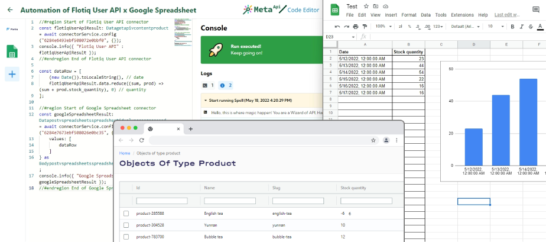{: .border}


## 1. Create an empty sheet in Google Spreadsheets

Let's prepare our spreadsheet to use in further steps. 
We add two columns (Date, Stock Quantity) and a chart with the default config for these columns.

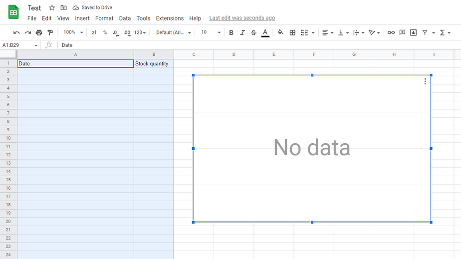{: .border}

Notice the `spreadsheet_id`. 
It's located in the URL `https://docs.google.com/spreadsheets/d/<spreadsheet_id>/edit#gid=0`. 
We will use it in the next steps.


## 2. Model your data in Flotiq

Sign in to your Flotiq account and make sure that you have added your Content Type Definitions. 
In our example, we use [predefined Product CTD](https://flotiq.com/docs/panel/predefined-content-types/) with an extra property named `stock_quantity`.

!!! Note
    If you are new to Flotiq, check the [Dashboard > Content Types](https://flotiq.com/docs/panel/content-types/)
    section in the docs

{: .border}

Now it's time to add some example data. 
As we are creative, we added more sophisticated data than "Lorem ipsum" :)

{: .border}


### 3. Get your OpenAPI Specification

This is a crucial step in Flotiq. 
Let's open your `API Doc` and download `OpenAPI Specification`.

{: .border}

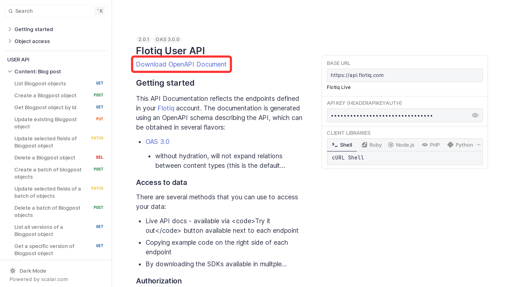{: .border}

We use the content of the downloaded file in the next step.


### 4. Add your Flotiq API to Meta-API

!!! Note "Why there is no predefined Flotiq API in Meta-API catalog?"
    The Main concept of Flotiq is that your API Specification literally represents your set of content definitions.
    Your API represents your endpoints, with your models consisting of your properties.
    In short, **Flotiq API contains personalized endpoints changed in real-time, according to your data**.

We assume that you have a Meta-API account.

Go to the [Catalog of API](https://dashboard.meta-api.io/connectors) and click "Add an API".

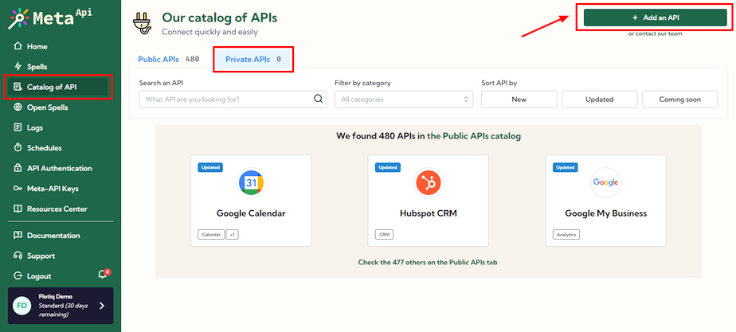{: .border}

In the `Add an API to the catalog` modal, go to the bottom and fill the `Open API Specification` field with data
retrieved in step 2. Other fields (except Category) should auto-complete.

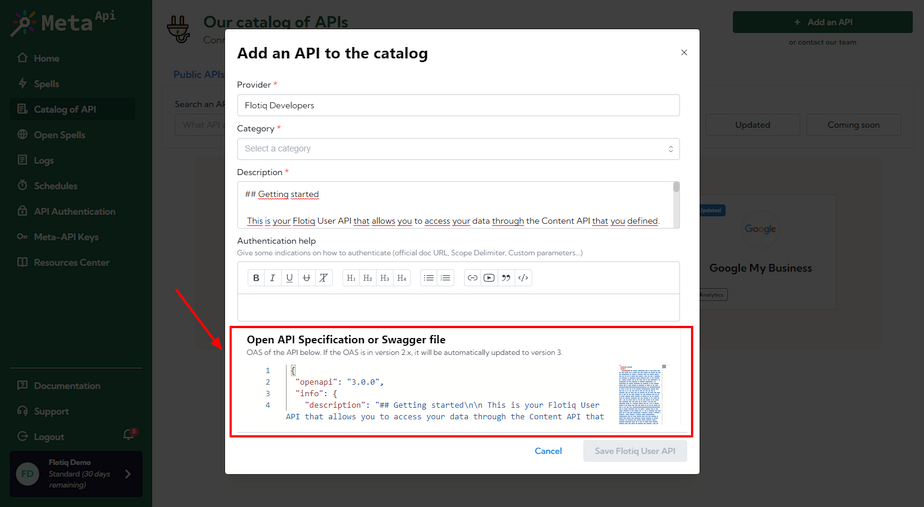{: .border}

And that's it. We have our private Flotiq API in our private Meta-API Catalog. 
Now we can use it to create a `Spell`.

!!! Note
    Every time your flotiq model changes ( and your API with it) you might need to update your meta API connection with new open-api specification

### 5. Create a Spell that connects Flotiq with any other API

When our API is added to Catalog, we can add a data flow between Flotiq and other applications. 
Go to the Spells section in Meta-API dashboard and click `Create a new Spell`.

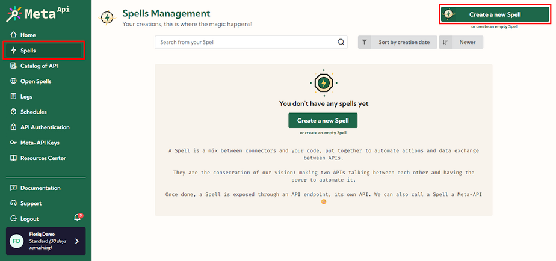{: .border}

In the `Choose the API` step, find your Flotiq API.

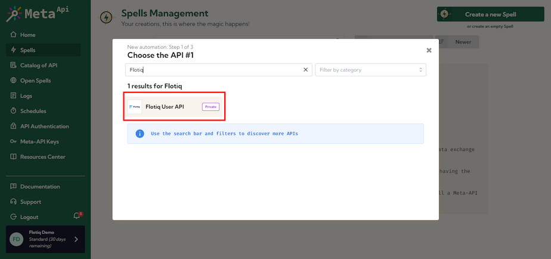{: .border}

Next, choose `Connector`, which means the configurable endpoint you want to call.
Select a products list endpoint (`GET /api/v1/content/product`). Click `Use`.

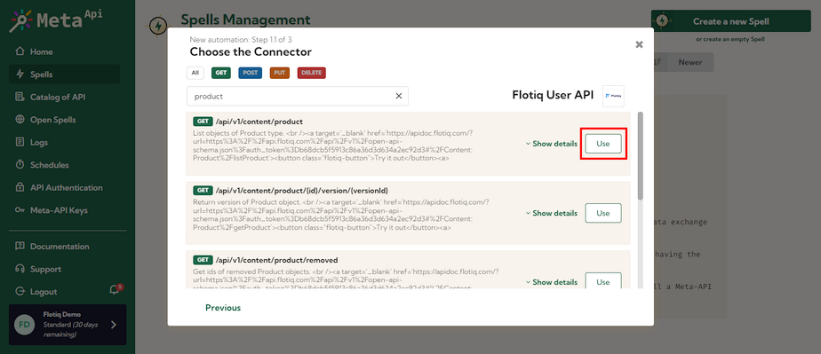{: .border}

Now it is time to connect Flotiq with other applications.

In our example we choose `Google Spreadsheet API`, and `append` Connector 
(which match `POST /v4/spreadsheets/{spreadsheetId}/values/{range}:append` endpoint).

A "Google Spreadsheet Append" connector is responsible for appending the values to a selected spreadsheet.

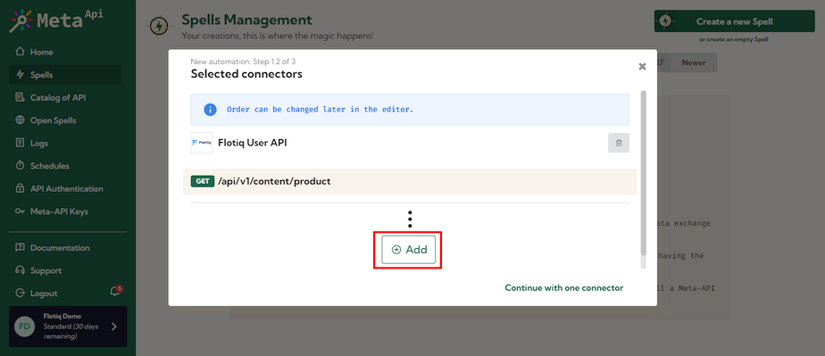{: .border}

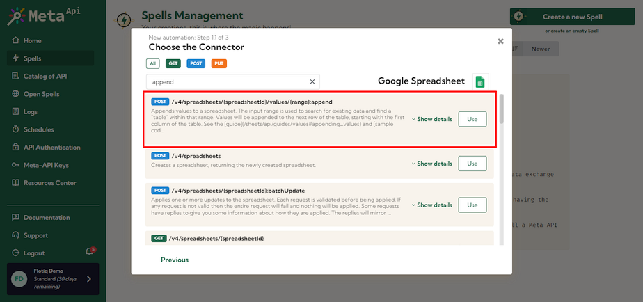{: .border}

Next, click "Continue with 2 connectors" and go through the following steps with values to create your Spell.

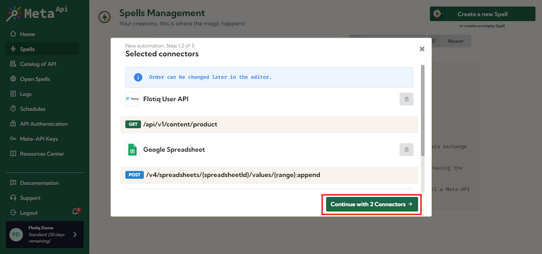{: .border}

Now you should see the edit Spell view.

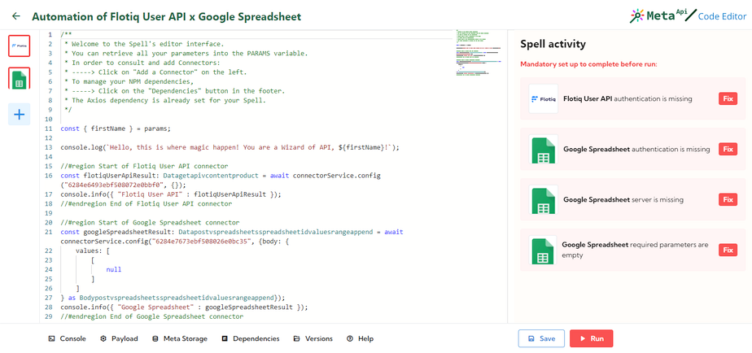{: .border}


## 6. Authenticate your Connectors

As you can see in the right sidebar, there are a few alerts. 
To update our configuration, click the "Fix" button next to Flotiq User API.

{: .border}

In the settings panel for Flotiq User API, click "Configure Authentication",
and paste here your API Key from Flotiq

!!! Note
    If you are new to Flotiq, check how to obtain your [Flotiq API Key](https://flotiq.com/docs/API/)

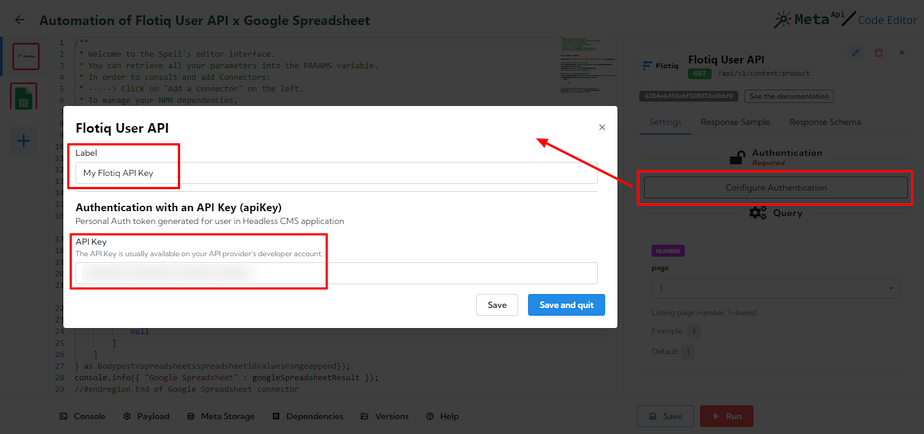{: .border}

Approve your settings and go back to the errors list clicking "x" in the sidebar.

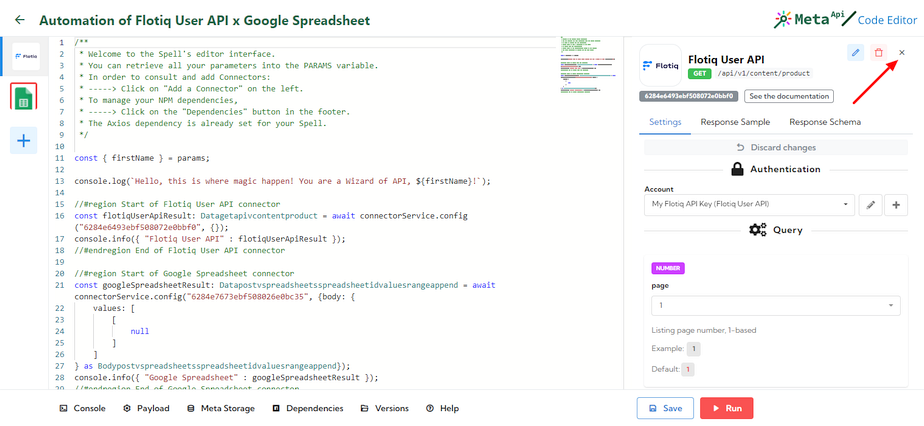{: .border}

The next step is to authenticate the Google Spreadsheet connector.
Click "Fix" next to "Google Spreadsheet".

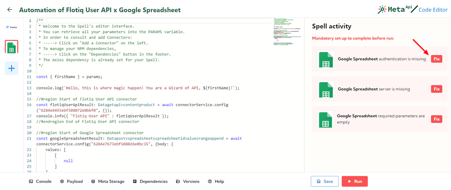{: .border}

This configuration is slightly different from Flotiq because it uses oAuth2.0. 
Use the "One-click Auth with Meta Api" wizard to authenticate.

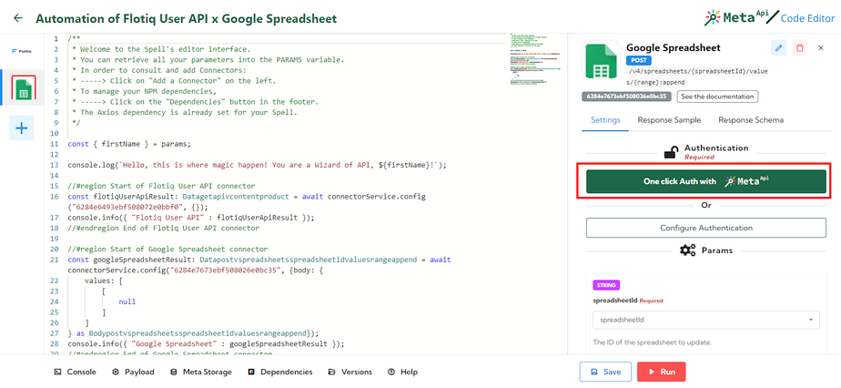{: .border}

There are also a few properties that should be updated in Google Spreadsheet Connector settings. 

Please set:

- `spreadsheetId` value to spreadsheet id obtained in the [first step](/docs/Deep-Dives/metaapi/#1-create-an-empty-sheet-in-google-spreadsheets),
- `valueInputOption` to `USER_ENTERED`,
- `range` to `A2`.

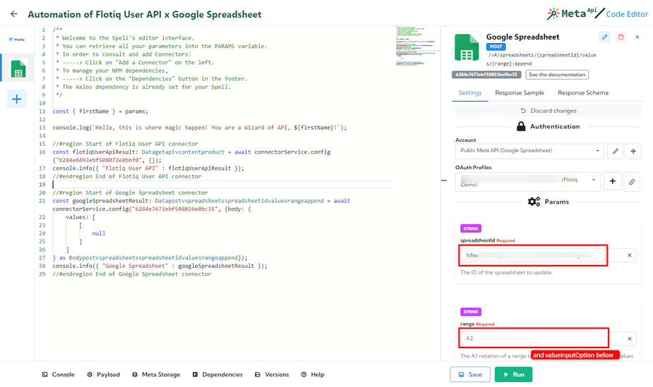{: .border}

We are almost ready!

## 7. Add code to process data

In the previous steps, we were focused on the sidebar in the spell configuration view.
Now let's move to the section with code.

It is up to you what transformations you will create here. 
In our case, we will sum up all product storage quantities and place them next to the current date.

So, update the code - add this snippet below `//#endregion End of Flotiq User API connector`:

```javascript
const dataRow = [
    (new Date()).toLocaleString(), // date
    flotiqUserApiResult.data.reduce((sum, prod) => (sum + prod.stock_quantity), 0) // quantity
];
```

And in the Google Spreadsheet connector code replace null with our dataRow:
```javascript
	values: [
		dataRow
	]
```

{: .border}

That's it! It's so simple to code your custom transformations. Ready to test?


## 8. Test the flow

Click the "Run" button on the right-bottom to test our Spell.

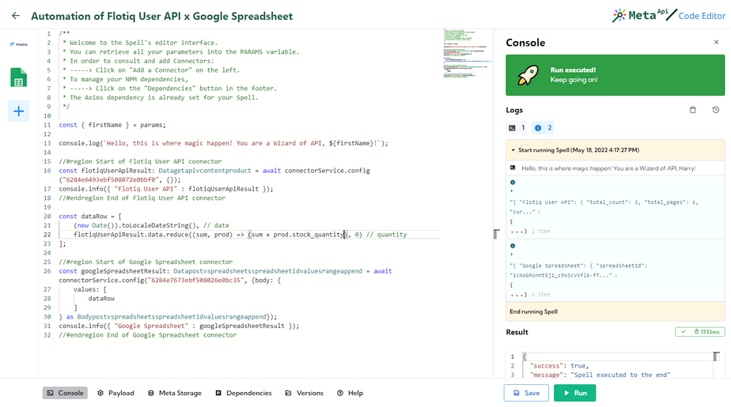{: .border}

Run succeeded. You can browse execution logs in the dashboard, but more exciting is our spreadsheet. 
Meanwhile, we made a few extra "Runs" and changed product quantities in the Flotiq dashboard.

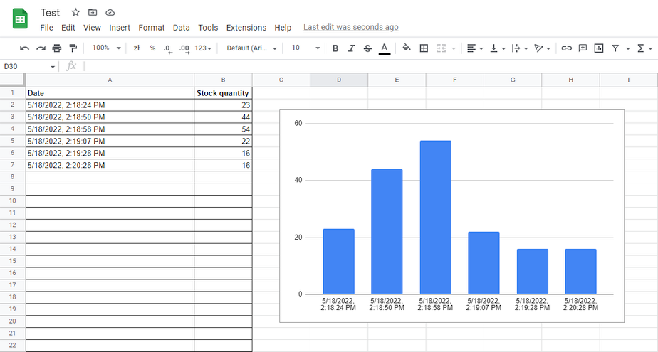{: .border}


# Next steps

As you can see, there are almost endless possibilities to use Flotiq and Meta-API integration.

We suggest you play with Flotiq and Meta-API:

* [Deploy your Spell](https://docs.meta-api.io/docs/deployment/versions) to run it with a simple HTTP request 
* Try to [schedule the Spell](https://docs.meta-api.io/docs/deployment/Scheduler) - run our stock report once an hour [link]
* Fire the Spell automagically after product update [using Flotiq Webhooks](https://flotiq.com/docs/panel/webhooks/)
