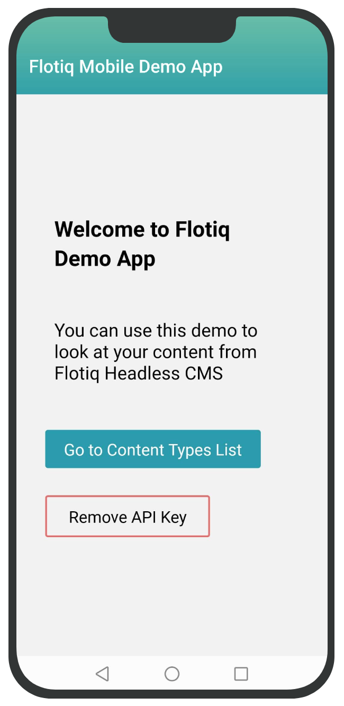
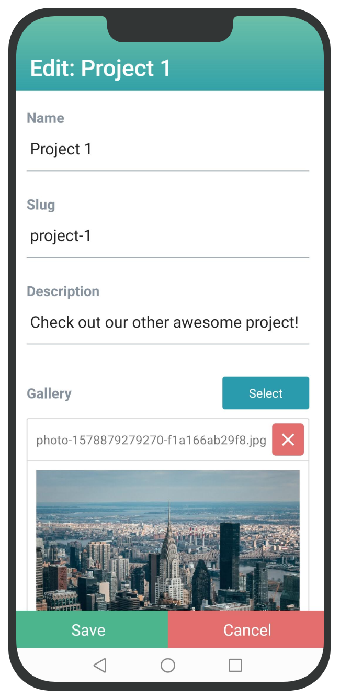
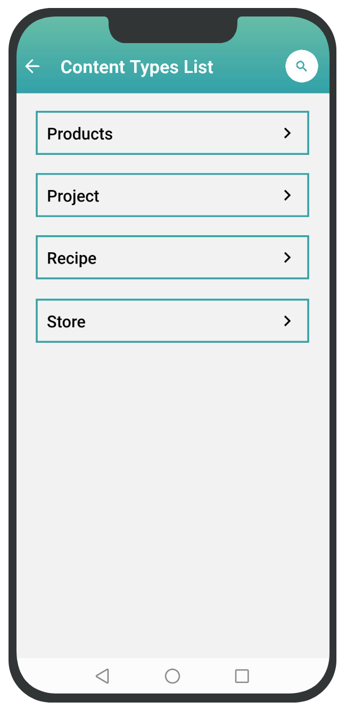
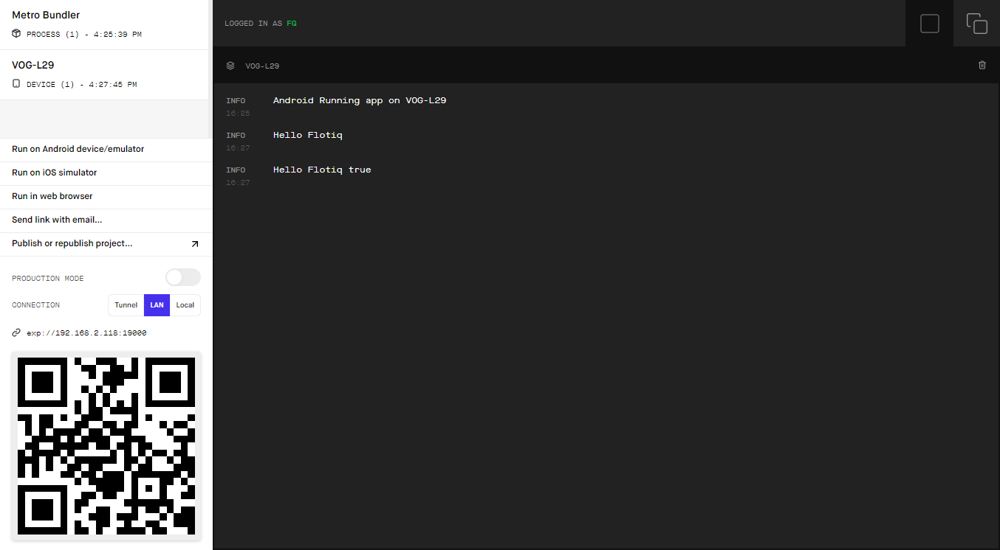

title: Flotiq Mobile Expo app for Content Editors & Developers | Flotiq docs
description: Use Flotiq Mobile Expo application to browse and manage your content directly from the mobile application

# Flotiq Mobile Expo app for Content Editors & Developers


[](https://apps.apple.com/app/flotiq-mobile-expo/id1505331246) [](https://play.google.com/store/apps/details?id=com.flotiqmobiledemo)


## For Content Editors: Browse and manage your content

The Flotiq Expo app is a React Native application which allows you to browse and manage your content directly from the mobile.

Regardless of what data you store in the Flotiq, the mobile application can provide convenient and quick access to the data.

Main features:

* Login via QR ApiKey Code
* List current Content Type Definitions
* Manage Content Objects
* Search through the Content Objects
* Upload photos directly from your smartphone camera

Ready-to-use application is available in Google Play or Apple App Store. Install the app, use the QR code in your API keys to connect the app to Flotiq and browse through your content.

{: .width25 }
{: .width25 }
{: .width25 }


## For Developers: Boilerplate for your new application


The Flotiq Mobile Expo is MIT-licensed app, so you can modify it for your needs and use in the next mobile project.

This project was implemented using:

* Expo
* React Native
* React Navigation
* React Native Elements
* Redux
* Flotiq as data source


{: .margin20 }
{: .margin20 }
{: .margin20 }


### Start your project in 3 simple steps

Thanks to [Expo.io](https://expo.dev) ecosystem you can run your application without installing any complex
tools like Android SDK, XCode or take care about your JDK version.

Follow these 3 steps to develop Flotiq based application:

1. Install expo
```shell
npm install --global expo-cli
```

2. Clone [GitHub](https://github.com/flotiq/flotiq-mobile-demo) project
```shell
git clone https://github.com/flotiq/flotiq-mobile-demo
```

3. Start developing
```shell
cd flotiq-mobile-demo/
npm install
npm start
```

This will start Metro server [http://localhost:19002](http://localhost:19002/) where you can start the app on Android and iOS simulator or on the real device.

{: .border}


To run app on the real device you have to have Expo Go app installed ([Android app](https://play.google.com/store/apps/details?id=host.exp.exponent), [iOS app](https://apps.apple.com/us/app/expo-go/id982107779)).

When you open Expo Go app you have to scan the QR code presented on the [http://localhost:19002](http://localhost:19002/) page.

!!! note
    More development tips you can find in the projects [GitHub repository](https://github.com/flotiq/flotiq-mobile-demo).

### Create your own products showcase mobile app

Check out our [simple guide](/docs/Deep-Dives/mobile-expo-product-showcase/) how to adapt the Flotiq Mobile Expo application source code
to work as a product showcase app.

