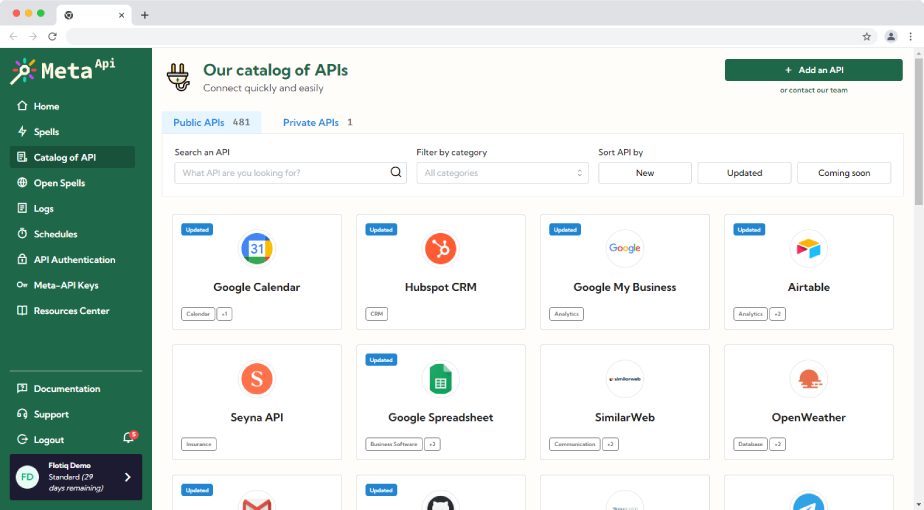

title: Flotiq and Meta-API integration | Flotiq docs
description: Use Flotiq and Meta-API to integrate your data with any API 

# What is Meta-API

[Meta-API](https://meta-api.io) is a platform for integrating and automating APIs. 
It uses connectors to represent API endpoints and Spells to define automation and data exchange between Connectors. 
You can define workflows for data mixing predefined APIs. 

There are over 480 public APIs in Catalog, including popular apps like Gmail, Google Calendar,
Google Spreadsheet, Twitter, etc.

META-API allows you to integrate multiple APIs for much easier data exchange and business logic implementation, using just a few lines of code.

What's more, the code can be entered in the browser in a special editor, which allows you to set connection parameters in the connector[^1] editing form, which makes for a very convenient tool for managing the code.
You can run your integrations periodically (e.g. synchronise products always at midnight) or on demand (e.g. using a webhook).

By adding your connector to [Flotiq](https://flotiq.com/){:target="_blank"}, you can conveniently base processes and enable Flotiq API processes.
For example, if you want to generate a daily report on product sales (with a chart) and save it in Google Spreadsheet, all you need to do is:

 * add a connector to Flotiq,
 * add a few lines in the "spell"[^2] editor, which will download the products and count the relevant statistics,
 * add a connector to Google Spreadsheets,
 * set the connector so that it writes the prepared statistics to Spreadsheet,
 * set a cyclic spell call.
The full description of the integration can be found in the [Deep Dives](../Deep-Dives/metaapi.md) section.

[^1]: Connector - a configurable API endpoint to which you want to make the request.
[^2]: Spell is a code that integrates with single or multiple connectors. It describes what you want to use API for.

