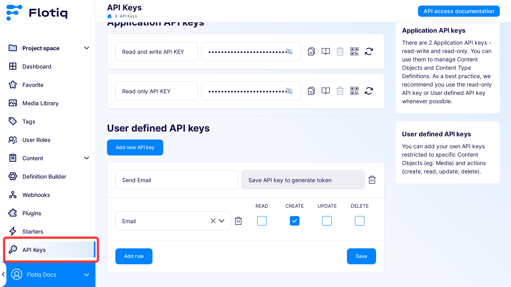
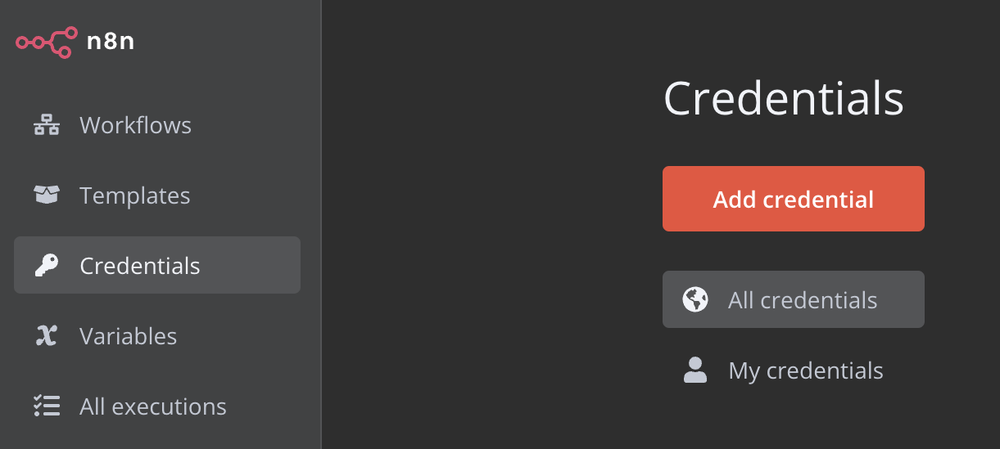
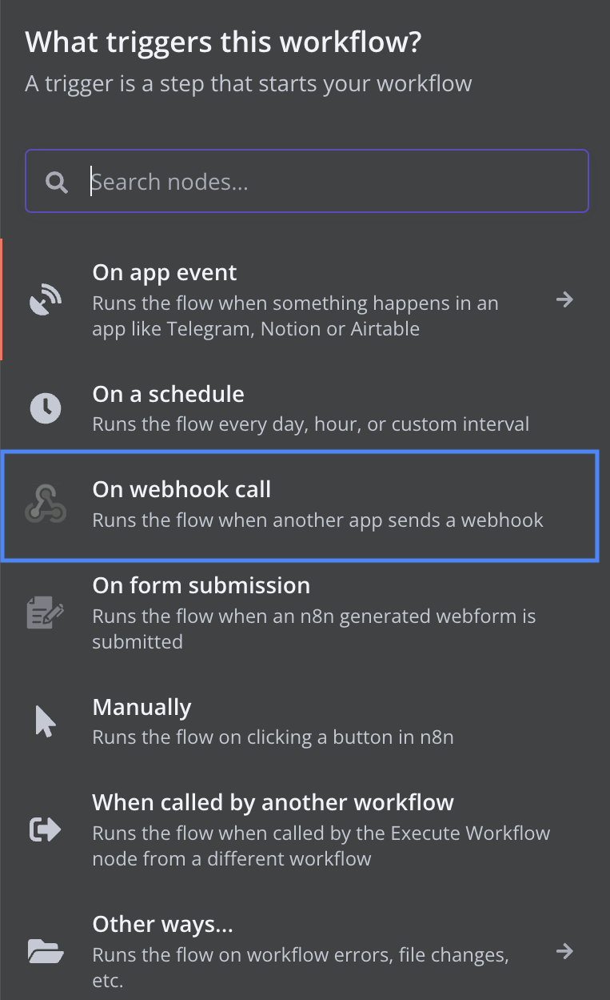
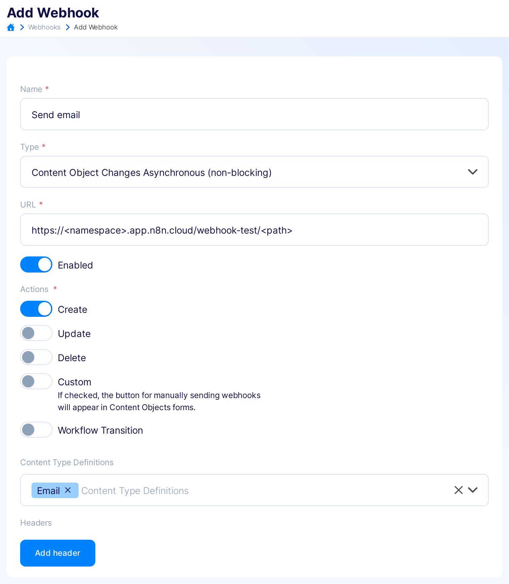
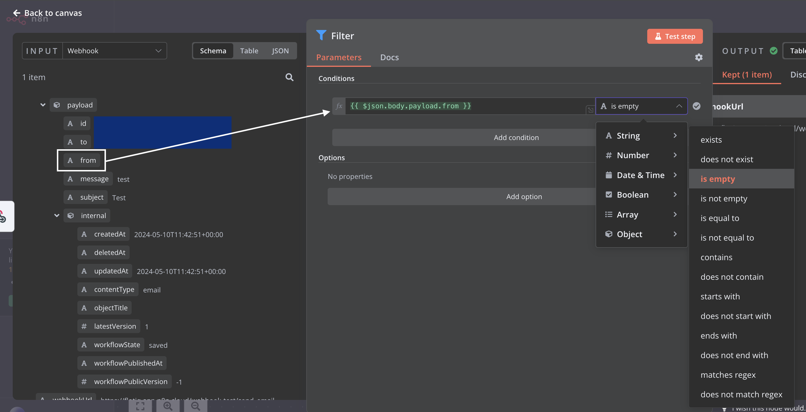
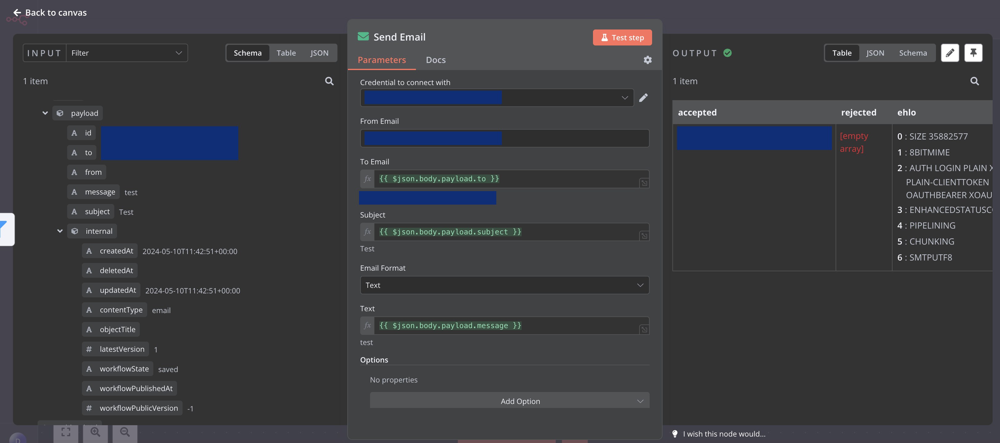
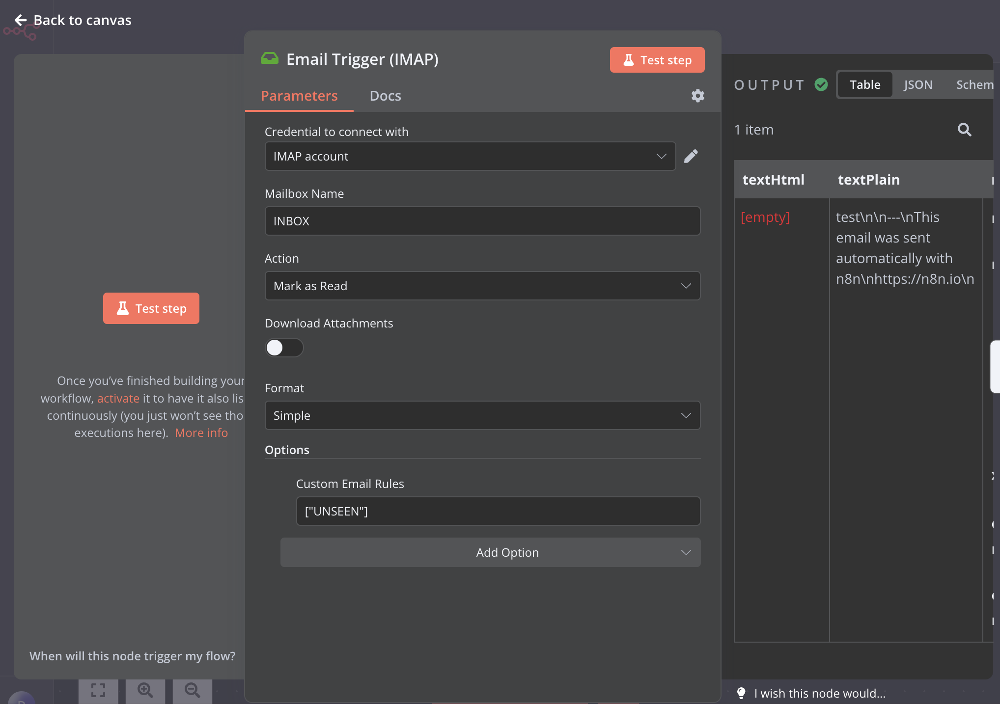
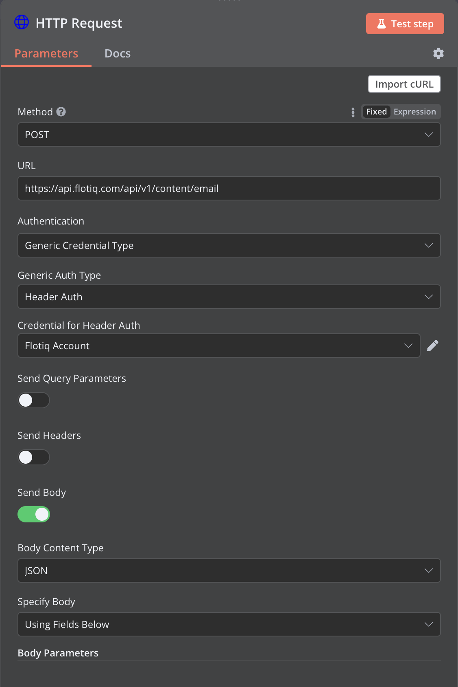
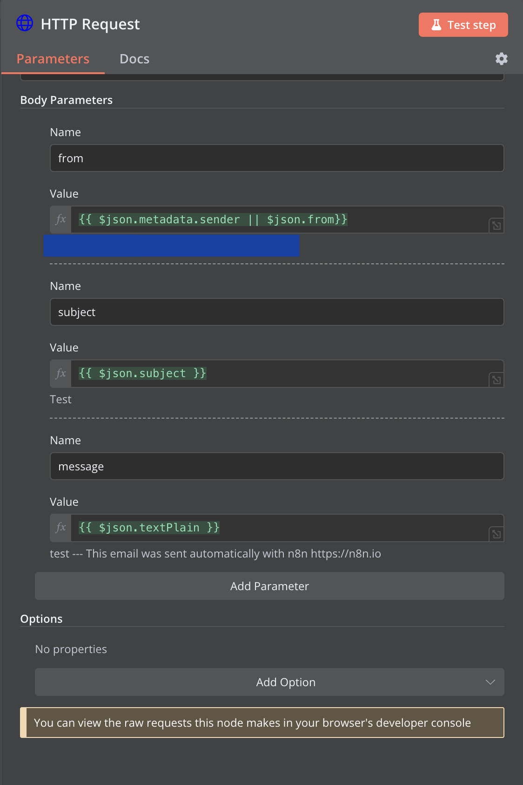
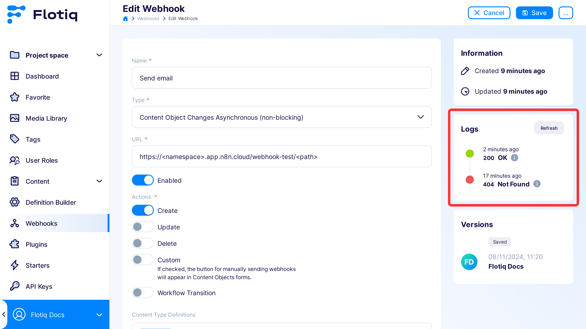

title: Flotiq n8n integration | Flotiq docs
description: Jump-start your workflow automation tool with n8n.

# Flotiq and n8n integration

## Introduction

[n8n](https://n8n.io/){target="_blank"} is an open-source workflow automation tool that allows you to connect various applications and services to automate repetitive tasks. It provides a visual interface where you can create workflows by connecting nodes, making it easy to design complex automation processes without the need for extensive coding. n8n supports a wide range of integrations, enabling seamless data transfer and process automation across different platforms. Let’s explore two use cases of integrations with [Flotiq](https://editor.flotiq.com/){target="_blank"}:

* Send an email when a new content object is created.
* Record data in Flotiq upon receiving an email.

Additionally, we will use an n8n HTTP request node credentials for [header authentication](https://docs.n8n.io/integrations/builtin/credentials/httprequest/?_gl=1*ufu4gh*_ga*MTY5ODcxNjE2MC4xNzE0MDM4Njcy*_ga_0SC4FF2FH9*MTcxNTI0OTgzMi41LjEuMTcxNTI1MDYwNi4zLjAuMA..#using-header-auth) with the [Flotiq API key](../API/index.md?h=api+keys#application-api-keys){target="_blank"}.

## Preparation Steps

For the specified integration use cases, we will:

1.  **Setup Content Type Definition**: Establish a Content Type Definition in Flotiq for data storage, which includes fields for email addresses, subject, and message.
2.  **Create Flotiq API Key**: Generate a dedicated API key for the new Content Type, enabling the 'create' action for email content.
3.  **Setup n8n Credentials**: Create header credentials to authenticate Flotiq requests.

!!! note
    Please note that these steps are part of a specific example of integrating Flotiq with n8n and may vary based on different use cases. For instance, you might want to use your own Content Type Definition or an API key with access to multiple Content Type Definitions.

### Setting up Flotiq

For the integration, it’s necessary to establish a Content Type Definition for data storage. You’ll need to create a Content Type Definition that includes specific fields:

* `to`: email (the recipient’s email address),
* `from`: email (the sender’s email address),
* `subject`: text, required,
* `message`: textarea.

This Content Type Definition can be set up either through the [Flotiq Dashbord](https://flotiq.com/docs/panel/content-types/){target="_blank"} or by utilizing the [API](https://flotiq.com/docs/API/content-type/creating-ctd/){target="_blank"}.

??? "To use the API, you can make a POST request with the following schema:"
    ```json
    {
        "name": "email",
        "label": "Email",
        "workflowId": "generic",
        "internal": false,
        "schemaDefinition": {
            "type": "object",
            "allOf": [
                {
                    "$ref": "#/components/schemas/AbstractContentTypeSchemaDefinition"
                },
                {
                    "type": "object",
                    "properties": {
                        "to": {
                            "type": "string",
                            "pattern": "^$|^[a-zA-Z0-9_.+-]+@[a-zA-Z_.+-]+?\\.[a-zA-Z]{2,}$"
                        },
                        "from": {
                            "type": "string",
                            "pattern": "^$|^[a-zA-Z0-9_.+-]+@[a-zA-Z_.+-]+?\\.[a-zA-Z]{2,}$"
                        },
                        "message": {
                            "type": "string"
                        },
                        "subject": {
                            "type": "string",
                            "minLength": 1
                        }
                    }
                }
            ],
            "required": [
                "subject"
            ],
            "additionalProperties": false
        },
        "metaDefinition": {
            "order": [
                "to",
                "from",
                "subject",
                "message"
            ],
            "propertiesConfig": {
                "to": {
                    "label": "To",
                    "unique": false,
                    "helpText": "",
                    "inputType": "email"
                },
                "from": {
                    "label": "From",
                    "unique": false,
                    "helpText": "",
                    "inputType": "email"
                },
                "message": {
                    "label": "Message",
                    "unique": false,
                    "helpText": "",
                    "inputType": "textarea"
                },
                "subject": {
                    "label": "Subject",
                    "unique": false,
                    "helpText": "",
                    "inputType": "text"
                }
            }
        }
    }
    ```
    { data-search-exclude }

To store received emails, it’s advisable to use a dedicated API key for the specific Content Type. Navigate to the `API keys` page and create a new API key. Assign a descriptive name to the new key, choose the email content type, enable the `create` action, and submit the form. If you cannot or prefer not to add a defined API key, you can use the read-write API key.

{: .center .width75 .border}

### Setting up n8n

To set up your credentials, proceed to the `Credentials` tab and select `Add credential`.

{: .center .width50}

Enter your SMTP and IMAP credentials corresponding to your mail servers. 

Then, add `Header Auth` credentials with the following details:

* `Name`: `x-auth-token`
* `Value`: The dedicated API key created in the previous step for email Content Objects.

You have the option to rename the credentials to something more descriptive by clicking on the credential modal header.

{: .center .width75 .border}

!!! note 
    You can add multiple header authentication credentials for different Content Objects or use a global read-write API key and apply a single header authentication credential for every request.

## Integration

### Sending an email from Flotiq

Begin by navigating to the n8n panel to add a new workflow. Click `Add first step` select the `On webhook call` trigger:

{: .center .width25 .border}

As a next setps:

* Set the HTTP Method to POST.
* Copy the Test URL from n8n and paste it into [a new webhook on the Flotiq dashboard](../panel/webhooks/index.md){target="_blank"}.
* Name the webhook, enable it, select the ‘create’ action, and link it to the Content Type Definition for email objects.

{: .center .width75 .border}

In the n8n webhook node, click `Listen for test event` and create a Content Object with the fields: `to`, `subject`, `message`, leaving the `from` field empty. Post-execution, your data should appear in the output column of n8n.

Return to the canvas and add a `Data transformation` node with a `Filter`. Use the `from` field from the input column as the condition and set the string filter to `is empty`. This filter ensures that only outgoing emails will be sent.



Next, add a `Send Email` node. Use the SMTP account credentials you added earlier. Populate the email fields by dragging and dropping from the Content Object. Test this step - you should see the message data in the output, and the email should be dispatched.



### Saving a received email to Flotiq

With the email sending setup complete, it’s time to configure the receipt of emails.

* Add an `Email Trigger (IMAP)` node.
* Select your IMAP credentials, mailbox, and set the action to `Mark as Read`.
* Include a custom email rule with `["UNSEEN"]` to filter for unread emails.
* Test this step by sending an email to the provided credential.

!!! warning "Marking emails as read is crucial to prevent multiple triggers for the same unread email."



For saving received emails add an `HTTP Request` node. Fill the form with following details:

* `Method`: POST
* `URL`:  Flotiq API endpoint for email content (https://api.flotiq.com/api/v1/content/email)
* `Authentication`: Generic Credential Type
* `Generic Auth Type`: Use the Header Auth credentials prepared earlier
* `Send Body`: true

Include body parameters: from, subject, message. Map these from the Content Object fields.

!!! note 
    For the `from` field, we used the fixed value `{{ $json.metadata.sender || $json.from}}` to accommodate various sender formats

<div markdown=1 class="grid-cols-2">
<div markdown=1></div>
<div markdown=1></div>
</div>

Test this step by sending an email to yourself. It should appear in Flotiq after a few minutes.

### Troubleshooting

If a sent email doesn’t show up in output column in n8n, check a **webhook page** in Flotiq Dashoboard for errors.



If a received email doesn’t show up in Flotiq, check the **all executions** tab in n8n for any POST method errors.


## Production mode

Here are the final steps to complete the integration:

1. Update Webhook URL: 

    * Click on the webhook node in n8n.
    * Copy the `Production URL` provided by n8n.
    * Replace the existing URL in the defined webhook for email creation in Flotiq with this new `Production URL`.

2. Activate Workflow:

    * Navigate to the **Workflows** tab in n8n.
    * Locate the workflow you’ve set up.
    * Activate the workflow by toggling the switch button.


That’s it! You’re all set. Now, you should be able to receive messages from your mailbox and send emails by creating Content Objects in Flotiq.
