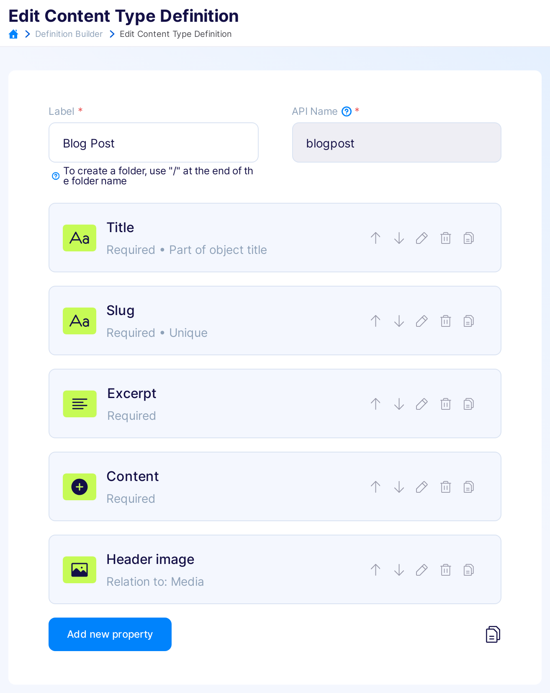
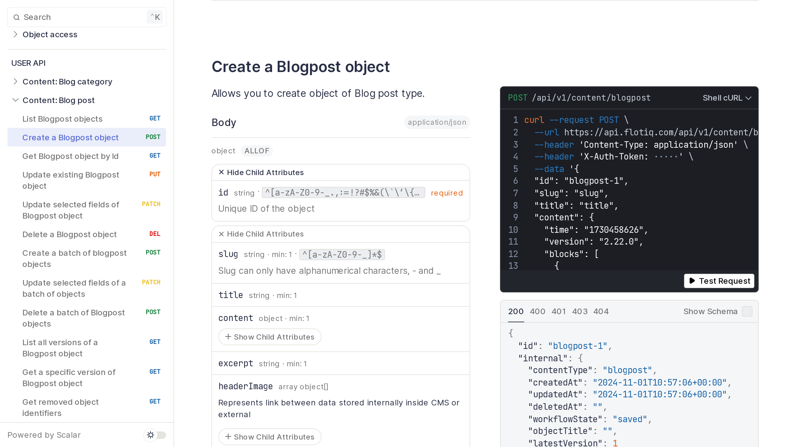

title: Flotiq documentation
description: Online documentation for Flotiq - the effortless headless CMS.

# Home

Welcome to Flotiq Documentation.

Here you will find everything you need to know about Flotiq. The documentation is divided into several sections:

- API - provides essential information about accessing Flotiq's APIs,
- Dashboard - gives a quick tour of the most important features of the User Interface,
- CLI - discusses the Flotiq CLI application and its basic use cases,
- Deep dives - collects tutorials and technical documents that dive deep into a particular scenario.

## What is Flotiq?

Flotiq is an API-first content management platform. It allows you to design your own content types and automatically generates supporting API, documentation, SDKs and Postman collection that help you work with your content in any language you choose. Flotiq's aim is to make you work comfortably with your content. That's why we provide a plethora of integrations and support for different languages in order to let you work how you like. 

## Key concepts

The key concept in Flotiq is the **Content Type Definition**. In any given use case you will end up crafting one or more Content Type Definitions. Once you define a Content Type - your own API will be updated to support new endpoints for that Content Type, also your documentation, SDKs and Postman collection will be regenerated to reflect that.

### Type definitions

Also referred to as Content Type Definitions - are the key part of the system, where you - the user - describe the content you will be storing in Flotiq. The Content Type builder is the tool we provide for you to easily define your Content Types, using a graphical User Interface. Type Definitions are like classes in object-oriented programming, they describe object properties. 

Read more about how to use the Content Type editor in the [Panel docs](panel/content-types.md)

You can also create and modify your Content Type Definitions using the API, please head to the [API description](API/index.md) for more information.

### Content Objects

For each Content Type you define - you can store multiple Content Objects. You can access these entries from the application sidebar and create new entries via the provided forms, which are automatically generated, based on the Content Type Definition you built. You can also work with your content in multiple ways through the API, please head to the [API description](API/index.md) for more information.

### Dynamic Content API

Flotiq does not force you to learn your API, instead we let you define it. Whenever you create or modify a Content Type - it will be automatically reflected in your API. On top of that - we provide beautiful API docs, SDKs and Postman collection - all based on your very own Content API. 

Read more in [Dynamic Content API](API/dynamic-content-api.md) section.
