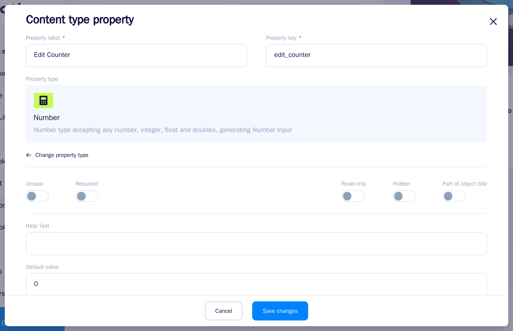

title: Lifecycle Webhooks - examples
description: How to use lifecycle webhooks in Flotiq - examples

# Lifecycle Webhook examples

## Example with payload modification
Przykład ten pokazuje jak usupełnić dane content obiektu przy pomocy zewnętrznego serwisu.
Po każdej aktualizacji obiektu BlogPost następi zwiększenie licznika `edit_counter`.

1. Dodaj dodatkowe pole do CTD BlogPost o nazwie `edit_counter` typu number z domyślną wartością 0.

{: .center .border}

2. Jakio `external system` możemy wykożystać prostą aplikację napisaną za pomocą express. 

```js
const express = require('express')
const app = express();
app.use(express.json());

const port = 8000;

app.post('/increment-edit-counter', (req, res) => {
  const payload = req.body.payload;
  payload.edit_counter + 1;  
  const response = {
    type: "response",
    subject: "content-object",
    event: "pre-create",
    response: {},
    payload: {payload}
  };

  res.send(response);
})
```
3. Dodaj [webhooka](https://editor.flotiq.com/webhooks/edit), wprowadź kjego nazwę (e.g. Edit counter), wybierz typ `Synchronous (block and wait for response)`, oraz podaj adres do uruchomionej aplikacji w pole `URL`, zaznacz pole `Enabled` oraz akcje `Update` następnie wybierz Content Type Definitions: BlogPost
4. Teraz za każdym razem jak ktoś zaktualizuje jakiś obiekt typu BlogPost automatycznie zostanie zwiększony licznik `edit_counter`.

{: .center .border}

## Example with custom validation
