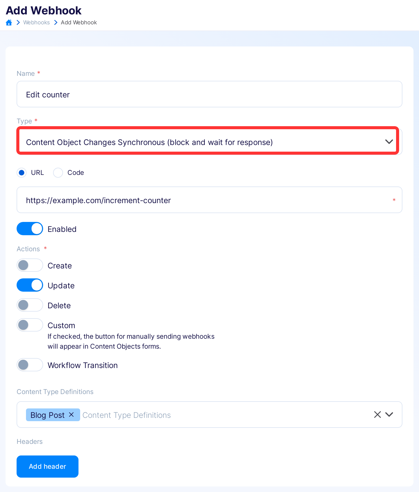

title: Lifecycle webhooks
description: How to use lifecycle webhooks in Flotiq

# Lifecycle webhooks

!!! note
    Flotiq lifecycle webhooks can be customized in enterprise version only.
    Reach out to us to discuss possible implementation.

## What is a Lifecycle webhook?
Lifecycle webhooks to odmiana webhooków które wykonują się synchronicznie.
To znaczy że gdy podczas modyfikacji CO zostanie uruchomiony lifecycle webhook to proces modyfikacji CO poczeka na response z webhooka.
Response z wykonania webhooka posłuży do modyfikacji CO. Jeśli dany Content object będzie miał kilka webhooków to podczas jego modyfikacji wykanają się wszystkie webhooki, response z pierwszego posłuży jako payload kolejnego.
Podczas wykononywania wielu webhooków ich kolejność nie jest określona.

## Jak to działa?
Podczas tworzenia/modyfikacji/kasowania content obiektu, zanim zmiany zostaną zapisane, Flotiq wyszukuje czy dla danego content obiektu są skonfigurowane webhooki.
Jeśli Flotiq znajdzie webhooki lifecycle, dane content obiektu zostaną wysłane metodą POST do zewnętrzego systemu pod  wskazanym przez webhookua adres.
Flotiq poczeka aż zewnętrzy system zwróci response, następnie zvaliduje go i podmieni payload content obiektu na ten przysłany z zewnętrznego systemu.
następnie obiekt zostanie zapisany/skasowany.

{: .center .border}

Tworzenie lifecycle webhooka jest analogiczne jak tworzenie standardowego webhooka, jedynie nalezy wybrać typ "Synchronous".
Pozostałe pola wypełniammy i używamy tak samo jak w przypadku zwykłych webhooków.

{: .center .border}

Teraz przed modyfikacją/tworzeniem/usunięciem content obiektu jego treść zostanie wysłana na podany przez webhooka adres.
Request ten ma następujący schemat:
```
{
    "type":"request",
    "subject":"content-object",
    "event": "pre-create",
    "sequenceNumber": 0,
    "payload": {
        ...
    }
}
```
Pola:

* type - typ, stała "request"
* subject - stała, "content-object"
* event - event na którym został wysłany request: pre-create, pre-update, pre-delete
* sequenceNumber - liczba przetworzeń obiektu
* payload - dane obiektu

Endpoint webhooka powinien odpowiedzieć responsem o schemacie:
```
HTTP 200:
{
    "type":"response",
    "subject":"content-object",
    "event": "pre-create",
    "sequenceNumber": 0,
    "response": {},
    "payload": {
        ...
    }
}

HTTP 400:
{
    "type":"response",
    "subject":"content-object",
    "event": "pre-create",
    "sequenceNumber": 0,
    "response": {
    "errors": []
    "payload": {
        ...
    }
}
```

Pola:

* type - typ, stała "respones"
* subject - content object, kopia z requestu
* event - event który wywołał respons, kopia z responsu
* sequenceNumber - liczba przetworzeń payloadu, liczba ta jest zwiększana z każdą podmianą payloadu w obiekcie
* response - kopia wysłanego nie przetworzonego payloadu
* payload - przetworzony payload którym zostanie zastąpiony content object

