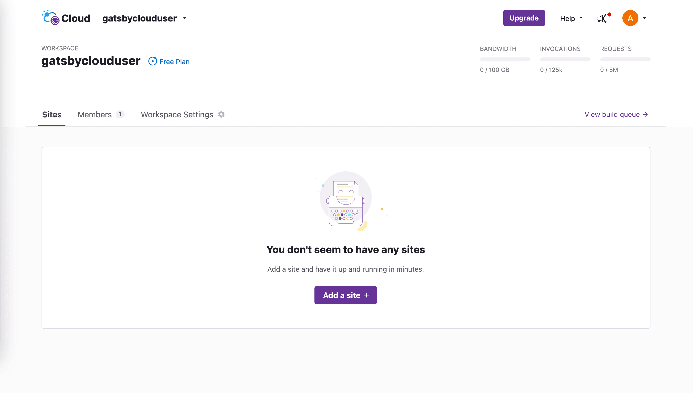
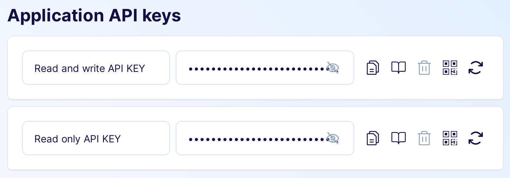
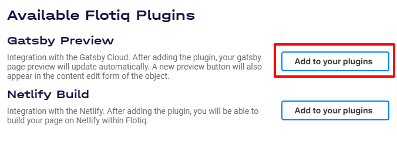
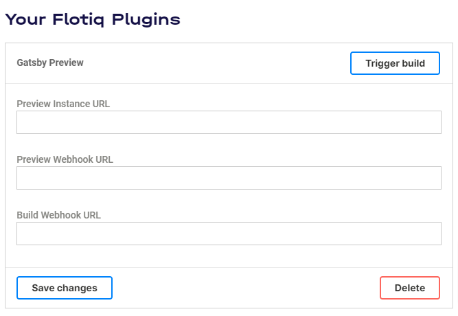
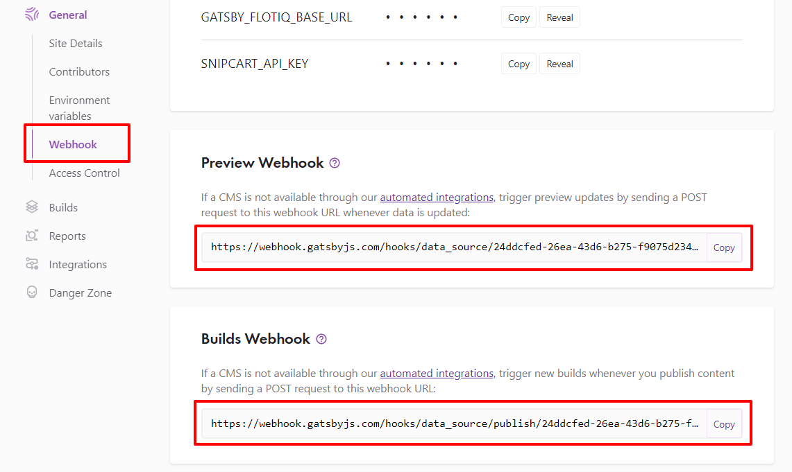
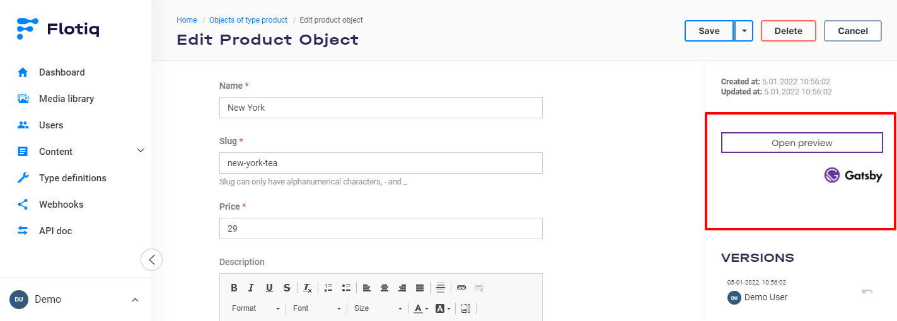

title: Integrate Gatsby Cloud and Flotiq | Flotiq documentation
description: Enable seamless Gatsby content preview using Flotiq Gatsby plugin.

# Connecting your Flotiq account to Gatsby Cloud

This article will walk you through the process of connecting your Flotiq account and your Gatsby Cloud account. By doing so, your content will be automatically synchronized with your Gatsby Cloud preview instance. You will also be able to easily navigate to your Gatsby Preview pages from the Flotiq content editor.

## Prerequisites

1. Flotiq account
2. Gatsby Cloud account
3. Gatsby website, sourcing content from Flotiq. 

!!! note 
    You might want to try one of our starters, which already come with predefined content:
    
    - [Recipe website Gatsby starter](https://github.com/flotiq/flotiq-gatsby-recipe-1){:target="_blank"}
    - [Event calendar Gatsby starter](https://github.com/flotiq/flotiq-gatsby-event-1){:target="_blank"}
    - [Project portfolio Gatsby starter](https://github.com/flotiq/flotiq-gatsby-portfolio-1){:target="_blank"}
    - [Simple blog Gatsby starter](https://github.com/flotiq/flotiq-gatsby-blog-1){:target="_blank"}
    - [Gatsby and Snipcart boilerplate, sourcing products from Flotiq](https://github.com/flotiq/flotiq-gatsby-shop-1){:target="_blank"}
    - [Snipcart and Next.js, sourcing products from Flotiq](https://github.com/flotiq/snipcart-nextjs){:target="_blank"}
    
    These starters all come with detailed READMEs and a one-line content import command, be sure to check those!
    You can find even more starters here: [Starting new Gatsby project with Flotiq](https://flotiq.com/docs/CLI/starting-new-project/){:target="_blank"}

## Signing in to Gatsby Cloud
Select `Sign in with GitHub`. You'll be asked to authorize the Gatsby Cloud app with your GitHub account. If you need to request access to one or more repositories, you can click "request access" here or later, when creating an instance.

Once signed in, configuring Gatsby Cloud with Flotiq requires several steps that are walked through below.

## Creating an instance

Once you've authenticated with Cloud and GitHub, you can create an instance from the ["Create a new Gatsby Cloud site"](https://gatsbyjs.com/dashboard/sites) page and add a site.

{: .center .width75 .border}

Pick your Gatsby site repo and branch from the list of GitHub repositories. You can use the search input to narrow down the list.

{: .center .width75 .border}

If you don't see your site, it might be because it belongs to a GitHub organization, rather than your personal account. You can connect a new GitHub Organization.

!!! Note 
    Repositories must contain one Gatsby project configured at their root to be enabled. Gatsby Cloud works best with Gatsby version 2.20.16 and higher.

### Manual Integration

{: .center .width75 .border}

First, click **"Skip this step"** to configure Flotiq manually.

Gatsby Cloud will automatically try and detect environment variables necessary in your `gatsby-config.js`. However — consider adding any additional variables that automatic detection may have missed. See "Setting up Environment Variables" for more info.

Note that you will be able to add, delete, or update these later on in "Site Settings".

Once you've added the necessary environment variables, you can press "Create site" which will create your instance in Gatsby Cloud!

### Site is Created

After following the "Automatic Integration" or "Manual Integration" flow, you now have an instance of Gatsby Cloud configured with environment variables, and a provided Gatsby Preview instance you can share with your team. Woo-hoo!

### Setting up Environment Variables

An environment variable references a value that can affect how running processes will behave on a computer, for example, in staging and production environments. You must save environment variables in Gatsby Cloud to authorize your instance to pull source data from Flotiq.

The essential 2 environment variables needed for every project are `GATSBY_FLOTIQ_API_KEY` and `GATSBY_FLOTIQ_BASE_URL`. In some cases, you will provide additional env variables for your application to work.

For example, if you're using the [Gatsby and Snipcart starter](https://github.com/flotiq/gatsby-starter-products){:target="_blank"} you will also provide the Snipcart API key.

{: .center .width75 .border}

To obtain the Flotiq API key - in your Flotiq account, click your profile icon in the sidebar and go to `API keys`:

{: .center .width25 .border}

You can either select the application-wide read-only key:

{: .center .width75 .border}

Or as a safer option, create a scoped read-only API key that will only be used for the purpose of Gatsby Cloud, read more about [Flotiq API access](https://flotiq.com/docs/API/).

Copy the Read-Only key and paste it in Gatsby Cloud settings as `GATSBY_FLOTIQ_API_KEY`. For the `GATSBY_FLOTIQ_BASE_URL` put `https://api.flotiq.com`.

Click **Save** once you've entered your variables.

Select **Create Site** and wait for the first preview instance to be created.

!!! Note
    Flotiq doesn't enforce any particular way of selecting drafts or non-public versions of your pages. The Read-Only key you copied will give you access to all your content. If you'd like to setup draft and public versions of your pages - you can do so by adding an extra field to your content types and querying for it in you GraphQL queries.

## Installing the Gatsby plugin

Open up your profile menu and select `Plugins`.

{: .center .width25 .border}

On the next screen, click on the `Add to your plugins` button next to `Gatsby Preview`.

{: .center .width75 .border}

Next - fill in the details from your Gatsby Cloud instance and click `Save changes` to finish your Gatsby Preview setup.

{: .center .width75 .border}

### Configuring Gatsby Preview plugin

The 3 elements you will need to copy from Gatsby Cloud is the Preview instance URL:

{: .center .width75 .border}

and the Preview and Builds Webhook URLs from Site Settings:

{: .center .width75 .border}

You will paste all three of them in Flotiq Gatsby Preview plugin settings, don't forget to click the `Save changes` button.

## That's it!

You're done. All your content will now automatically stay in sync with your Gatsby Cloud preview instance, and you will see the preview button in the Flotiq content editor.

{: .center .width75 .border}
