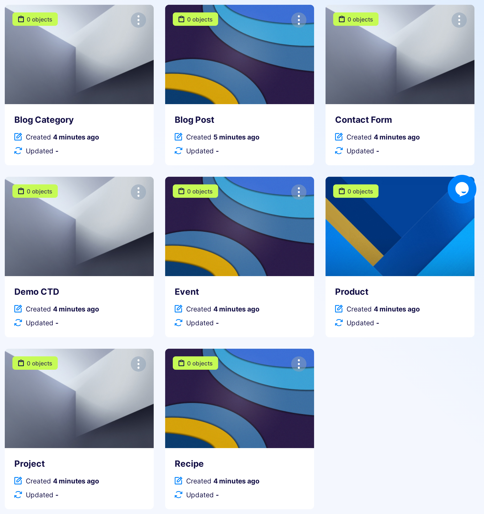
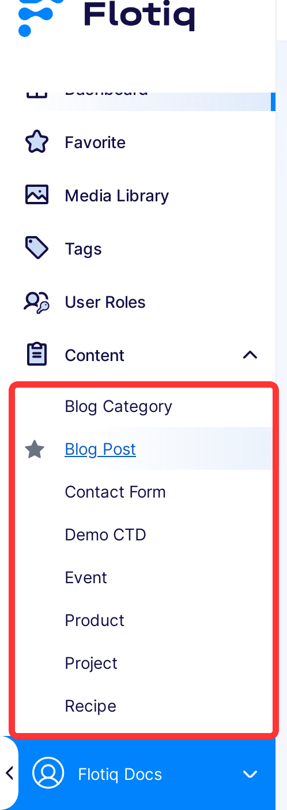
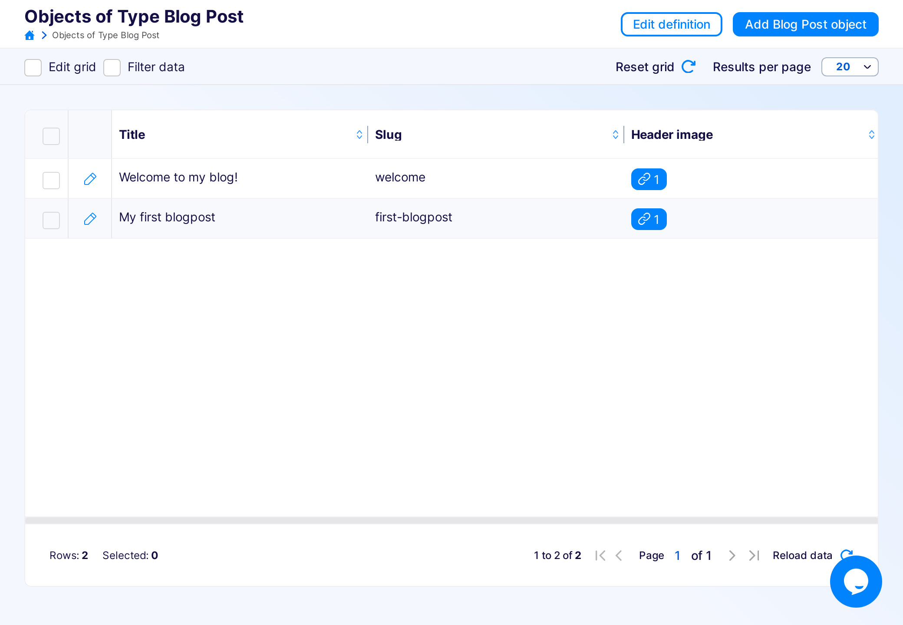
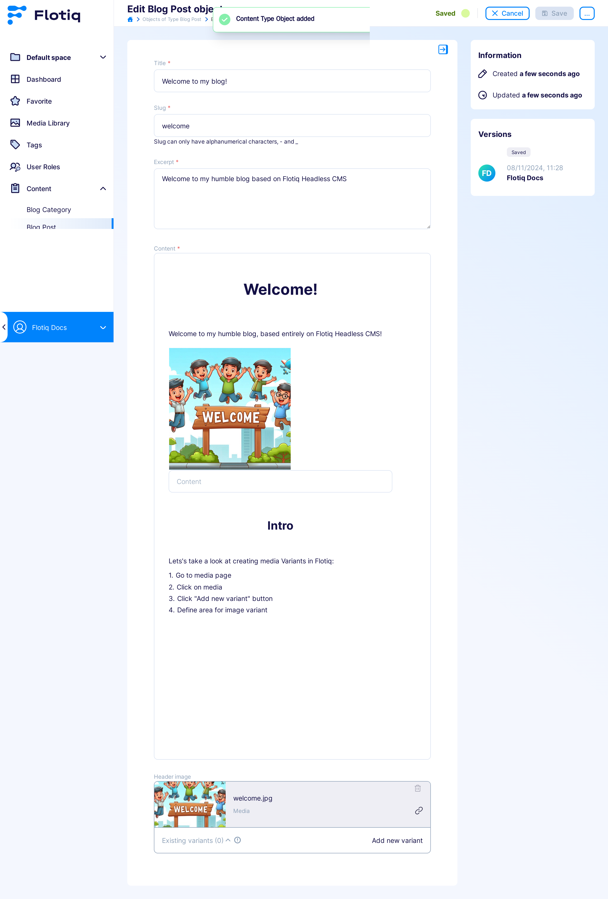

# Content Objects

Once a Content Type has been defined in the system - the user can create Content Objects of that Content Type.
This is done either directly through the API or via the convenient Content Entry tools
provided within the [Flotiq Dashboard](https://editor.flotiq.com){:target="_blank"}.

## Authoring content :fontawesome-solid-triangle-exclamation:{ .pricing-info title="Limits apply" }[^1]

The Content Entry component consists of two elements - the content browser and the content editor.

Click tile on the Type Definitions to go to the content browser page:

{: .center .width75 .border}

or entry in the left menu:

{: .center .border}

The content browser provides a convenient grid interface to browse and search through large amounts of data quickly.
Users can customize the grid according to their preferences:

{: .center .width75 .border}

From the grid, the users can go to the form that allows them to edit particular Content Objects:

{: .center .width75 .border}

There are 15 types of controls in the dashboard, all described in detail below:

* [Text](#text)
* [Long text](#long-text)
* [Markdown](#markdown)
* [Rich text](#rich-text)
* [Email](#email)
* [Number](#number)
* [Radio button](#radio-button)
* [Checkbox](#checkbox)
* [Select](#select)
* [Relation](#objects-relations)
* [Media relation](#media-relations)
* [List](#list)
* [Geo](#geo)
* [Date](#date)
* [Block](#block)

All required fields are marked with a red asterisk - *.
You can save Content Object only when you insert values in all required fields.

Interaction buttons of Content Objects are in the top right corner of the edit screen:

{: .center .border}

To save and stay on the form, click the `Save` button.

To save and leave the form, click the arrow on the right of the `Save` button and then click the `Save and leave` button.

To leave the form without changing anything, click the `Cancel` button.

### Text

Standard text input.

### Long text

Standard textarea input, preserving newlines as `\n`.

### Markdown

Input for the markdown.
You can write in markdown or use WYSIWYG to generate one; the switch is on the right bottom corner of the control.
Flotiq does not validate the Markdown code.

Markdown controls:

{: .center .border}

* Full screen - opens the full-screen markdown editor, helpful when editing long texts.
* Heading - switch edited line to a heading (`# heading 1`)
* Bold text - bolds texts (`**text**`)
* Italic text - slants text (`*text*`)
* Strikethrough text - cross out text (`--text--`)
* Insert horizontal line - inserts horizontal line (`***`)
* Blockquote - insert blockquote block (`>`)
* Bulleted list - insert unordered list (`* list item`)
* Ordered list - insert ordered list (`1. list item`)
* Checkbox list (task) - insert list with checkboxes (`*[] list item`)
* Indent - makes indentation bigger
* Outdent - makes indentation smaller
* Insert table (2x2 - 10x15) - inserts table with the header and at least one row
* Insert image - please use it only for adding images from outside of the Flotiq (switching the tab to `URL`),
  as it puts base64 of the image into the markdown, if you wish to add an image from Flotiq, use the `Open media library` button
* Insert link - inserts link, (`[link description](link url)`)
* Open media library - opens Media Library, where you can add new files or select the ones already added
* Inline code - insert inline code formatting (`` `inline code` ``)
* Insert code block - insert code block formatting

For better explanation of markup please refer to [Markup Guide](https://www.markdownguide.org/basic-syntax/){:target="_blank"} by Matt Cone.

### Rich text

Rich text control help format text and generates HTML markup.
Formatting works similar to MS Word or Google Docs formatting.

Rich text controls:

{: .center .border}

First row:

* Bold text - bolds the text
* Italic text - slants the text
* Underline text - underline the text
* Strikethrough text - cross out the text
* Remove format - remove all formatting from the text
* Ordered list - adds ordered list, to change the level of the list, use tab
* Bullet list - adds unordered list, to change the level of the list, use tab
* Aligning text - align whole paragraph or header
    * Left
    * Center
    * Right
    * Justified
* Insert horizontal line - adds a horizontal line
* Add link - adds a link to selected text
* Remove link - removes the link from the text

Second row:

* Paragraph format - formats whole paragraph
    * Normal
    * Heading 1
    * Heading 2
    * Heading 3
    * Heading 4
    * Formatted
* Font - change font of the selected text
    * Default
    * Arial
    * Comic Sans Ms
    * Courier New
    * Georgia
    * Lucida SAns Unicode
    * Tahoma
    * Times New Roman
    * Trebuchet MS
    * Verdana
* Font Size - change size of the selected text
    * Auto
    * 8, 9, 10, 11, 12, 14, 16, 18, 20, 22, 24, 26, 28, 36, 48, 72
* Font color - only few colors are possible

    {: .border}

* Highlight colour - only a few colours are possible

    {: .border}

* Show blocks - shows boundaries of HTML tags
* Format image - you should use it after adding the image from the Media Library,
  to make sure that the image is in the system correctly.

    You can add alternative text, change the dimensions, position and border of the image.
    You can also add a hyperlink to it by switching to the `Link` tab.
  
    {: .border}

* Media library - opens Media Library, where you can add new files or select the ones already added
* Display source - shows editable HTML markup of field contents; please change it with caution.

You can make the editor bigger by dragging the grey arrow on the bottom right corner of the control.

### Email

Text input with email validation.

### Number

Number input. The range is from `-2^53 + 1` to `2^53 - 1`, safe precision is `10^-10`.

### Radio button

Standard radio button control.

### Checkbox

Standard checkbox control.

### Select

Standard select control. You can choose only one option.

### Relation

Flotiq has two types of relations in the dashboard (they are managed in the same way in the json object):

{: .center .width75 .border}

If you want to remove the linked object, click the `trash` icon on the object's right side.
You can change the order of objects in relation using arrow buttons in the top right corner.
If it is not a Media object, you can edit it by clicking the `pencil` button in the top right corner.

#### Objects relations

You can either open the form for object creation using the `Add new object and link` button:

{: .center .width75 .border}

After saving the object, the system automatically links it to the object you are editing/creating right now.

Or you can also click the `Link existing object` button and link the object created earlier:

{: .center .border}

To add the object, click on the desired object and then the `Add` button.
You can search and sort objects using the controls on top of the modal.

!!! note    
    For now, you can only add one object or file at a time.

#### Media relations

The `Open Media Library` button opens Media Library, where you can add new files or select the ones already added.

{: .center .width75 .border}

To add the media object, click on the desired file and the `Save changes` button.
Newly uploaded files are automatically selected; you only need to click the `Save changes` button.

### List

If the object has a list property, Flotiq generates series of sub-forms with properties described in such list:

{: .center .width75 .border}

To add the new object to the list, click the `Add item` button.
You can change the order of objects in the list using the up and down arrow in the top right corner of object form.
You can remove the object from the list using the trash icon in the top right corner of the object form.

If the list property contains a `list` child property, the nested form will be displayed.

### Geo

Control for geolocation points. You can find the address using `Find on map` input or by dragging the marker on the map.
You can put the coordinates in `Latitude` and `Longitude` inputs below the map if you know the coordinates without searching.

{: .center .width75 .border}

### Date

Date control. You can write the date and time or choose them from the popups.

{: .center .width75 .border}

### Block

Developers friendly content builder.
You can add texts, headers, lists, media, YouTube videos, quotes, warnings and delimiters.
The control generates json description of the blocks used.

{: .center .width75 .border}

To add the block different from standard text, click the `+` button and choose the block from the controls.

Block controls:

{: .center .border}

You can tune every block by clicking the dots button in the top right corner of the block.
In all the tune menus, you can move the block up (`arrow up` button),
remove the block (`X` button) and move the block down (`arrow down` button).

* Text - block for standard paragraph content.

    {: .border}
  
    The tunes allow to align the text in the paragraph (left, center and right).
  
    You can change the block type by selecting part of the text and opening the convert menu by clicking the `T` button.
    You can also bold (`B` button) or slant (`i` button) selected text or add a link to it (chain button).
  
    {: .border}

* Heading - block for standard header content.

    {: .border}
  
    The tunes allow to change the level of the header, add an anchor link to it or align the text in the header (left, center and right).
  
    You can change the block type by selecting part of the text and opening the convert menu by clicking the `H` button.
    You can also bold (`B` button) or slant (`i` button) selected text or add a link to it (chain button).
  
    {: .border}

* List - block for ordered and unordered lists; you can increase the level of the list using tab.

    {: .border}
  
    The tunes allow changing the type of the list.
  
    You can bold (`B` button) or slant (`i` button) text or add a link to it (chain button) by selecting part of the text.
  
    {: .border}

* Media - block for files (images, videos, audio, pdf)

    After you choose this block, the `Media library` button will appear.
    To choose an image, video or text file, you need to click that button and find the file you need to attach to the block.
  
    You can add a border, stretch or add background to the file in the tunes menu.
  
    {: .border}

* YouTube video - block for videos from YouTube; this block has only common tune settings.
* Quote - block for quotes with captions

    {: .border}
  
    The tunes allow aligning the text in the quote (left and center).

* Warning - block for warnings with place for the name and message; this block has only common tune settings.
* Delimiter - block indicating delimiter; it does not have any content; this block has only common tune settings.
* Code - block indicating code block; this block has only common tune settings.
* Table - block for table

    {: .border}

    The tunes allow adding information whether the table has header or not.

## Deleting content

You can delete the object either by clicking the `Delete` button on the edit object page (in the top right corner):

{: .center .border}

Or by selecting it on the content browser and clicking the `Remove selected` button:

{: .center .border}

!!! warning
    You can only remove objects that are not linked to any other object in the system.

## Content versioning

The form view also displays information about previous versions of a particular Content Object.
From this view, you can also switch to older revisions.
To save older revisions, click on the version tile and click the `Save` button.

[^1]: The number of available Content Objects depends on the chosen subscription plan.
Check pricing and limits [here](https://flotiq.com/pricing){:target="_blank"}
