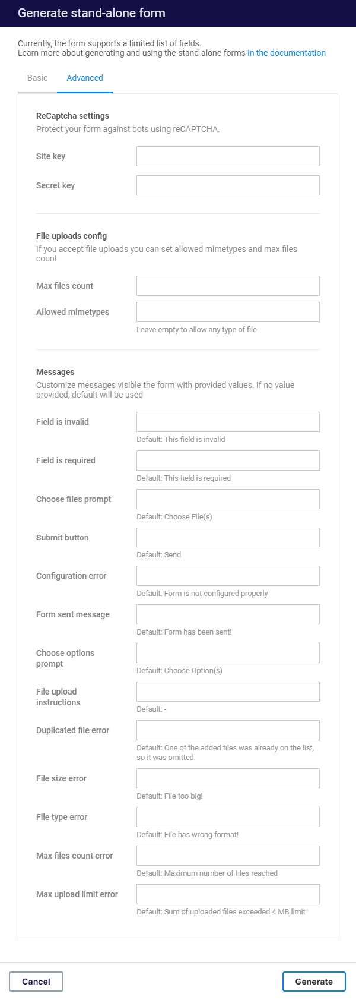
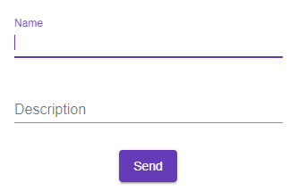
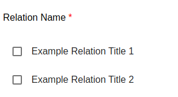

title: Flotiq Forms - the easiest way to add forms to static websites | Flotiq documentation
description: Use Flotiq Forms for an easy way to add forms to static websites and collect feedback from your users. Flotiq Forms is always up to date with your content model and keeps your forms spam-free and secure.

# Flotiq Forms

Headless content management systems work best if you actually have, ehm, content that you can keep in them. Flotiq Forms makes it dead-simple to put a form on any website to start accepting user data and make it automatically adapt to your data model in Flotiq. Like everything else in Flotiq - the forms will automatically update with any changes you make in your content type definitions, so you're always covered! Forms also support anti-spam and security features, so you don't have to worry about that, either.

## Features

Here are the most important features of Flotiq Forms:

- one-click HTML form
- copy and paste to your webpage
- works with serverless and static websites
- no coding required
- automatically updated to match your Flotiq Content Types
- provides anti-spam and security features out of the box.

## Restrictions

Not all types of form fields are supported. The unsupported field types are:

- Markdown
- Rich text
- List
- Geo
- Block

## How to generate HTML forms

You can generate an HTML form that you can put on any webpage you like.
The form will be automatically kept up to date with changes made to the Content Type Definition that this form is linked to.

Form generation is available in the Content Type Definition edit form. You can generate forms for all of your Content Types without restrictions.

To generate a new stand-alone form click `Generate` button:

{: .center .width75 .border}

It will display a modal where you need to provide some details.

!!! hint
There are only two required details you have to provide:

    * `Domain` - Forms will only accept data from this domain; put `*` if you want to allow access from anywhere,
    * `API key` - select the API key you want to use for incoming form submissions.
    
    As best practice - we advise you to enter your domain (without `http://` or `https://`) and create a dedicated, scoped API key that only allows `CREATE` access to handle form submissions.

Don't worry - your API key is secure. It's not displayed anywhere in the form and is only used internally for a set of serverless functions, which work under the hood to deliver your Forms. You can always revoke or regenerate the key if you have any suspicions it might have been compromised.

If you use the `Generate new API key` button - a fresh, scoped API key will be created automatically for you, along with the recommended permissions.

{: .center .border}

When the domain and API key are in place, you can click on the `Generate` button. Please be patient; it may take up to a minute to generate the required code.

You can specify some advanced settings to make the form fit better to your page by clicking the `Advanced` tab before generating the form (but you can always update it later):

{: .center .border}

### Advanced settings:

#### ReCaptcha settings

Protect your form against bots using reCAPTCHA.
You need a Google account and registered site
(you can do that [in Google reCaptcha console](https://www.google.com/recaptcha/admin/create)).

| Setting    | Description                                                                                        |
| ---------- | -------------------------------------------------------------------------------------------------- |
| Site key   | We use this key in the HTML code of the form; you can find it in the Google reCAPTCHA settings.    |
| Secret key | We use this key to verify the request from the form; you can find it in the Google reCAPTCHA settings. |

{: .center .width75 .border}

#### File uploads config

If you accept file uploads, you can set allowed mime-types and max files count.

| Setting           | Description                                                                                                                                                                                                                                                                                                                                                                                                                             |
| ----------------- | --------------------------------------------------------------------------------------------------------------------------------------------------------------------------------------------------------------------------------------------------------------------------------------------------------------------------------------------------------------------------------------------------------------------------------------- |
| Max files count   | Maximum number of file that user will be able to add in one form submit.                                                                                                                                                                                                                                                                                                                                                                |
| Allowed mimetypes | Mime types of files user can upload, you can leave that empty if you allow any type of file. Possible mime types are: `image/gif`, `image/png`, `image/jpeg`, `image/bmp`, `image/webp`, `image/svg+xml`, `image/svg`, `image/x-icon`, `image/vnd.microsoft.icon`, `text/plain`, `audio/midi`, `audio/mpeg`, `audio/webm`, `audio/ogg`, `audio/wav`, `video/webm`, `video/ogg`, `video/mp4`, `application/pdf`, and `application/json`. |

#### Messages

Customize messages visible in the form with provided values; you can use it, for example, to translate the messages to the language of your site.
If no value provided, the default value will be used.

| Setting                  | Description                                                                                                                  | Default                                                           |
| ------------------------ | ---------------------------------------------------------------------------------------------------------------------------- | ----------------------------------------------------------------- |
| Field is invalid         | Displayed when the type of inserted value of the filed does not match the type specified in the schema                         | This field is invalid                                             |
| Field is required        | Displayed when a required field is not filled                                                                                  | This field is required                                            |
| Choose files prompt      | Text on the upload file button                                                                                               | Choose File(s)                                                    |
| Submit button            | Text on the submit button                                                                                                    | Send                                                              |
| Configuration error      | Text displayed when the form has required fields not supported by form generator, displayed when the form has not been sent properly | Form is not configured properly                                   |
| Form sent message        | Displayed when the form has been sent properly                                                                                   | Form has been sent!                                               |
| Choose options prompt    | Displayed above options in relations fields                                                                                  | Choose Option(s)                                                  |
| File upload instructions | Optional instructions displayed above upload file field                                                                      |                                                                   |
| Duplicated file error    | Displayed when user put the same file twice in upload file field                                                             | One of the added files was already on the list, so it was omitted |
| File size error          | Displayed when the size of the file exceed the max file size                                                                     | File too big!                                                     |
| File type error          | Displayed when mime type of the file do not match the mime types specified in form settings or in Flotiq settings            | File has wrong format!                                            |
| Max files count error    | Displayed when user upload more files than specified in the settings                                                         | Maximum number of files reached                                   |
| Max upload limit error   | Displayed when the sum of the uploaded files exceeds 4 MB                                                                        | Sum of uploaded files exceeded 4 MB limit                         |

!!! note
    Flotiq uses Amazon Web Services (AWS Lambda in particular) to deliver Flotiq Forms to our users. AWS provides a global network of secure data centres, which allow us to easily expand our services and provide the best value to our customers. 

## How to use Forms

Once your Flotiq Forms are generated, you will see a window with two lines of HTML code. You need to put them inside your HTML page to start immediately collecting data to your Flotiq account.

1. Put the first code - `<link rel="stylesheet" href="https://flotiq-form-generator-styles.s3.amazonaws.com/styles.css"/>` in the `<head>` section of your page, if you wish to use our styles:
   {: .center .border}
1. Put the second code - `<flotiq-form/>` in your page, wherever you want the form to be displayed.
1. Paste the third line - `` at the end of your HTML, just before the  `</body>` tag.

{: .center .border}

You can edit all settings of your form by clicking the `Edit form settings` button.

!!! note
    Please be advised that, as for now, you can add only one type of form on a page.
    If you wish to use more than one form, you have to put them on different sub-pages.

## Media

Media relations are handled as a file upload. The Sum of files sizes cannot exceed 4MB. You can allow multiple file uploads by
checking `multiple` option in media relation filed in Content Type Definition settings, which form was generated for.

## Other relations

Other relations are displayed as a checkbox or radio button group, determined by the `multiple` option in the relation field in Content Type Definition settings, which form was generated for.

Single relations display example:
{: .center .border}

Multiple relations display example:
{: .center .border}

!!! note
    You can display only existing relations. You cannot make users add one by form.

## Working example

You can see a working example below, it's just a `<flotiq-form/>` tag, that we pasted in our HTML:

<flotiq-form></flotiq-form>

You can use the form to tell us what you think about Flotiq Forms :)
