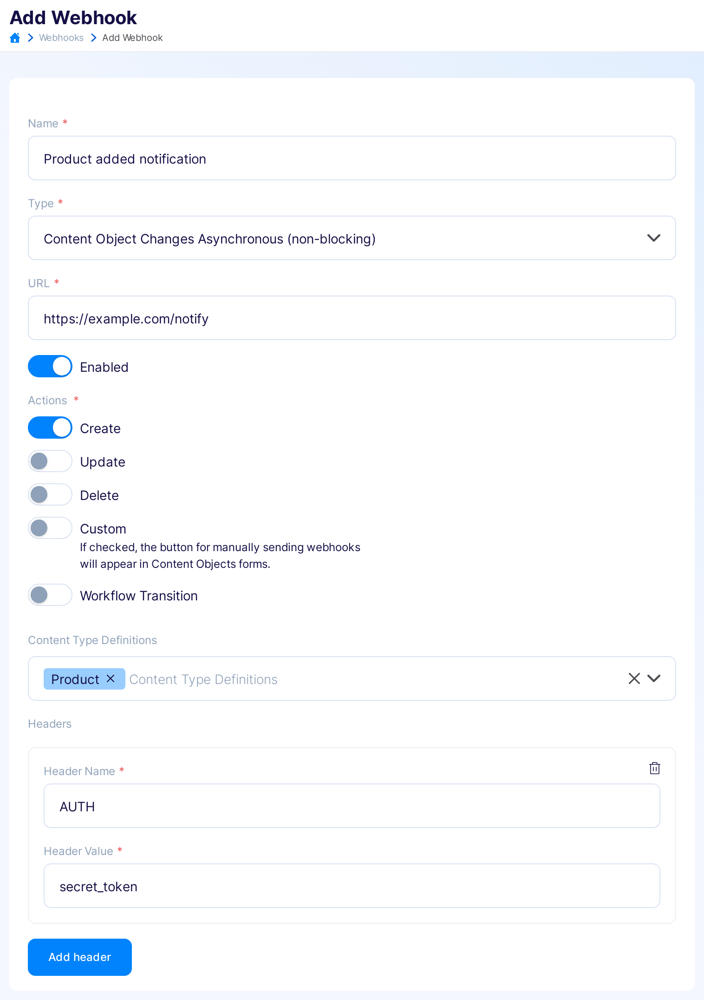
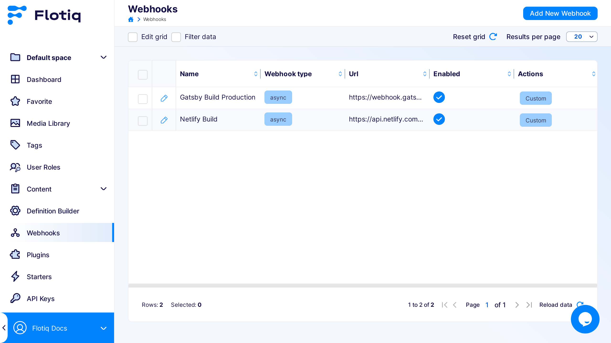
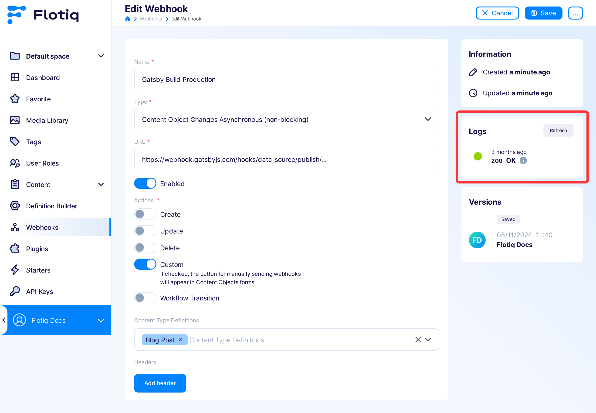
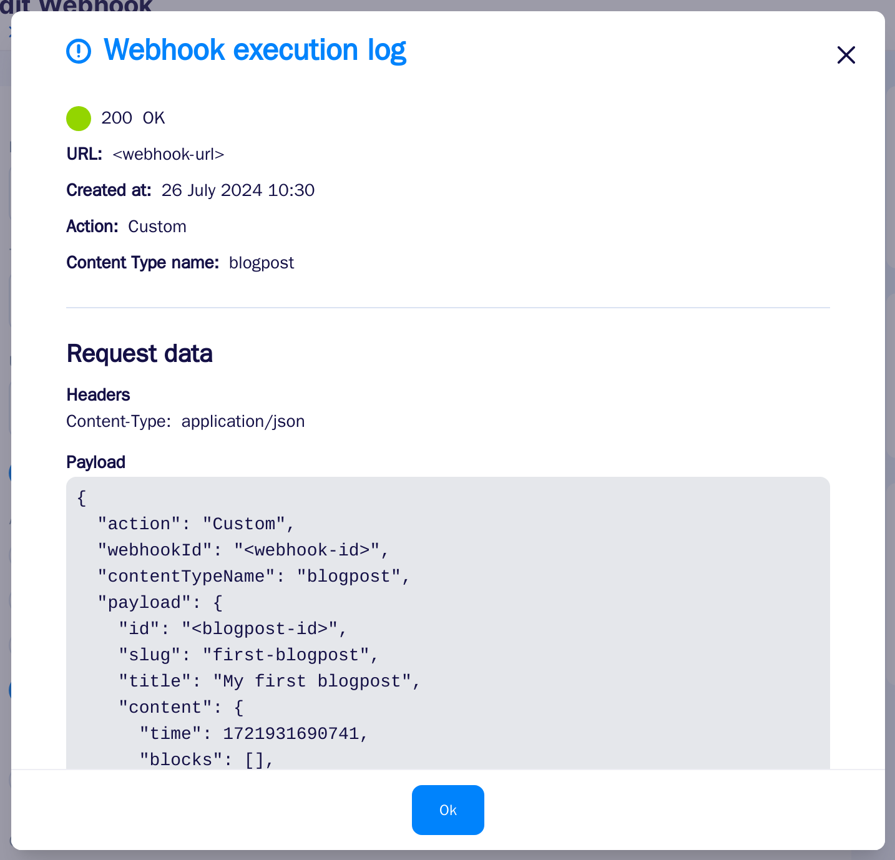

title: Async CO webhooks
description: Async webhooks in Flotiq

# Async webhooks

Performing actions on the content, you can automatically **notify other external services**, and order them to perform additional actions, e.g. sending an email after adding a comment.

What **external services** could handle webhook notifications from Flotiq? The number of potential integrations is almost endless. In addition to your implementations that respond to changes in Flotiq, you can use many ready-made systems open to this way of communication.

!!! Note
    Purely technically, webhooks are HTTP requests with specified payload performed automatically when selected actions in Flotiq occurs, e.g. when content was added.


## Async webhooks common use cases

Webhooks can help with many scenarios; here are some examples:

* Sending a push notification to the app users when the new article was created.
* Sending a free e-book when the landing page form was submitted.
* Sending a hello email when the contact form was submitted.
* Adding an event to the Google calendar when the event in Flotiq was added.
* Sending a chat notification when the new entry was added.
* Sending an email to the moderator when the new article comment was submitted.

You can also improve your development workflow using webhooks:

* Run CI/CD pipeline on Bitbucket/GitLab/GitHub when site content was changed.
* Trigger a Netlify/Gatsby preview build when site content was changed.
* Trigger a Netlify/Gatsby production build when a `Build production` button was clicked.
* Trigger AWS Lambda serverless function when entry is changed.

As you can see, there are a lot of possible integrations. You can implement your applications or microservices or use existing systems like Slack, Google Calendar, Google Spreadsheets, Mailchimp, Mailgun, Git, Gitlab, Bitbucket, AWS Lambda, Heroku, Netlify and so on.

!!! Note
    Check out our [Examples](/docs/panel/webhooks/examples/) page to see how to implement simple but powerful integrations based on webhooks.

## Do I need a webhook?

Webhooks are useful if you want to **extend the system functionality** or **integrate quickly with other apps** that fit your business process. You can enable or disable webhooks at any time without any effort.

## Define Webhooks with Flotiq

### Creating a Content Object changes webhook

To create a Webhook, click on the main menu `Webhooks` -> `Add new Webhook`.

{: .border}

!!! Note
    `Async Content Object Changes` webhook `type` is default option, you don't have to worry about setting proper type    

!!! Note
    The above configuration means: Send a POST request to `https://my-example-app.com/notify` with an `AUTH` header of `secret_token` when the new `product` in Flotiq was `created`.

Flotiq allows you to specify the following webhook properties:

#### Name
The name of your webhook.

#### Url
The URL address, with `https://` prefix, on which the request will be sent.

#### Enabled
Whether the webhook is currently enabled.

#### Actions
Actions performed on Content Objects that trigger the webhook execution:

* `Create` - when the Content Object was created,
* `Update` - when the Content Object was updated,
* `Delete` - when the Content Object was deleted,

Additionally, there is a `Custom` option.
When you choose this, the webhook can be manually triggered, at any time, in the Content Object editing panel (read more in the [How to execute custom action webhook](#how-to-execute-custom-action-webhook) section).
Multiple actions can be selected.

#### Content type definitions
What types of objects in Flotiq the webhook applies to.
The list includes all user types in the system.
Multiple types can be selected.
If no type is selected, all types will be listened for.

#### Headers
The headers to add to the HTTP request made by Flotiq.

### Listing your webhooks

To view existing webhooks, click `Webhooks` on the Flotiq main menu.
The table shows all the webhooks available in your account.

{: .border }

### How to execute Create, Update, Delete webhook

All you need to do is perform the chosen action (`Create`, `Update` or `Delete`) on the selected Content Object, in the `Flotiq panel` or using the `API`.
Then the webhook will be executed.

!!! Note
    It is worth mentioning that the webhooks with Create, Update and Delete actions are executed regardless of whether they were performed from the Flotiq dashboard or via API.


### How to execute custom action webhook

Webhooks with a `Custom` action assigned can be launched manually, at any time, by clicking the button in the Content Object editing view.

Additionally, if the object is not saved, the execute webhook button will save the object.
The custom action is not possible to be performed from the API level.

{: .border }


### Webhooks payload

When a Webhook is executed, a payload containing information about the webhook,
the action name (`Create`, `Update`, `Delete`, `Custom`) and the content object data is sent to the target URL.

```json
{
  "webhookId": "_webhooks-167011",
  "action": "Create",
  "contentTypeName": "product",
  "ref": "/api/v1/content/product/product-399121/version/1",
  "payload": {
    "id": "product-399121",
    "name": "Premium pack",
    "price": 500,
    "internal": {
      "createdAt": "2021-11-22T10:47:16+00:00",
      "deletedAt": "",
      "updatedAt": "2021-11-22T10:47:16+00:00",
      "contentType": "product",
      "objectTitle": "Premium pack"
    }
  }
}
```
{ data-search-exclude }

Note: When executing the `Delete` action, only the object's id is sent in the payload:

```json
{
  "webhookId": "_webhooks-167011",
  "action": "Delete",
  "contentTypeName": "product",
  "ref": "/api/v1/content/product/product-399121/version/1",
  "payload": {
    "id": "product-399121"
  }
}
```
{ data-search-exclude }

## Webhook execution logs

To track your webhooks activity, go to the `Edit` webhook screen.
In the sidebar, you can browse webhook execution logs.

{: .border }

The details of the single webhook execution, such as request payload and server response, are available after clicking on a single record.

The execution of a webhook can have one of the following statuses:

* pending (system noticed the action, webhook is queued)
* done (webhook was executed and received `HTTP 2xx` response code)
* error (webhook was executed with issues, e.g. target URL was not found, or the response was not in the `HTTP 2xx` range)

{: .center .width75 .border}

Flotiq will keep 300 last execution logs. Older entries will be removed.


## Frequently Asked Questions

### How many webhook calls I can execute?
There are no limits in the webhooks execution count. In this situation, you should take care of the Flotiq monthly call limits.

### Are there any additional costs for making webhook requests?
No, there are no additional costs for executing the webhook.

### How many webhooks I can create in the Free plan?
In the Free plan, you can add 5 webhook definitions.

### What is the IP range of webhook calls?
The webhooks will be executed from the `us-east-1` region of AWS. For the actual IP ranges check [AWS docs](https://docs.aws.amazon.com/general/latest/gr/aws-ip-ranges.html) or the [JSON file](https://ip-ranges.amazonaws.com/ip-ranges.json).

### What does the ‘Request failed’ status mean?
This status means that the target URL specified in the webhook configuration was not reachable.

### Will the webhook run immediately?
The webhook will be queued immediately after the trigger action will be performed. Webhook processing (from queue handling to the final HTTP request) may take a few seconds.


[Register to create your first webhook](https://editor.flotiq.com/register.html){: .flotiq-button}
