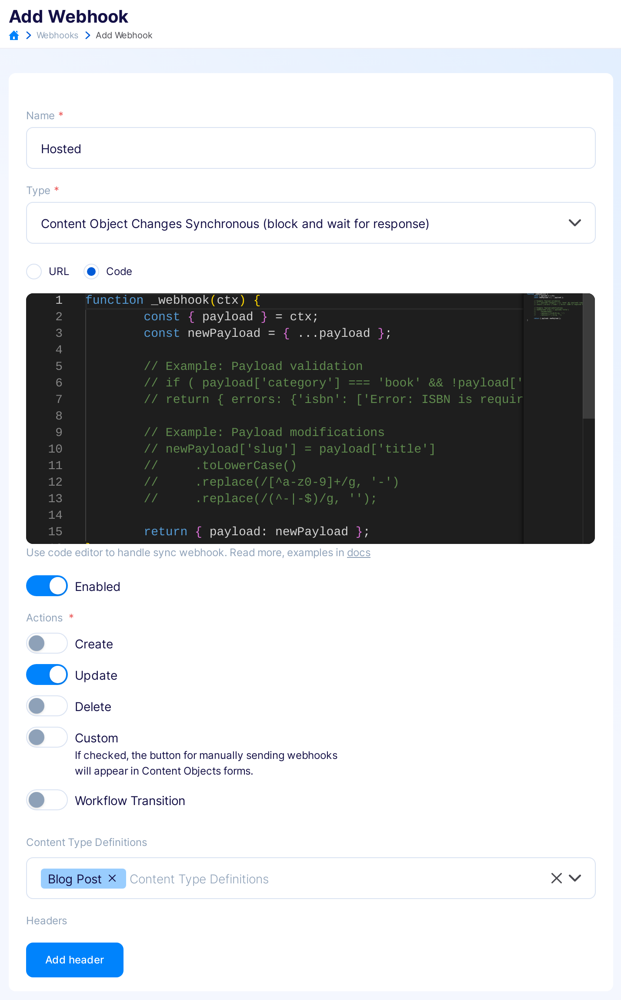

title: Hosted webhooks
description: How to use hosted webhooks in Flotiq

# Hosted Webhooks

!!! Note
    Hosted Sync Webhooks are available starting from the Basic plan and above. Check pricing and limits on the [Flotiq Pricing page](https://flotiq.com/pricing){:target="_blank"}

## What are Hosted Webhooks?

Hosted Synchronous Webhooks allow you to execute custom code in response to specific events in your Flotiq system. These webhooks provide powerful capabilities to manipulate data, perform validations, and more, by embedding custom logic directly within your workflow.

Example Use Cases:

* Slug Generation: Dynamically generate and assign slugs for content objects based on their titles or other fields.
* Field Validation: Ensure that the value of one field is not less than the value of another field before allowing the operation to proceed.
* Incrementing a Counter: Automatically increase a counter value each time a specific event occurs.

## Setting Up Hosted Sync Webhooks

Creating a Hosted Sync Webhook follows a similar process as for sync webhooks. Once you select the type of your webhook to "synchronous", you will be presented with radio option, to choose between a standard URL webhook or hosted webhook.

Once you choose the "Code" option, an embedded code editor will show up, allowing you to easily write code for your hosted webhook without the need for the use of any IDE. The editor will contain example code snippets; one of which allows you to validate the target content object, and the second example that will mutate the content object, automatically creating a slug from the title property.

{: .center .border}

While the code supports most of the ES2023 syntax, it still has some limitations/requirements:

* The code must be synchronous. Async/await, promises, and generators are not supported.
* The entrypoint must be defined as either function `_webhook(ctx) {}` or `const _webhook = ctx => {}`.
* The body of the content object is available in `ctx.payload`.
* The function must return an object in the form `{ payload: {} }` or `{ errors: {} }`.
* Currently, modules, dependencies, and HTTP requests are not supported.

## Example Functions

Below are some example functions demonstrating common uses of synchronous hosted webhooks in Flotiq.

### Incrementing a Counter

The following hosted webhook takes the 'counter' property from a content object and raises it by 1.

```
function _webhook(ctx) {
    const { payload } = ctx;
    const newPayload = { ...payload };

    newPayload['counter'] = (payload['counter'] || 0) + 1;

    return { payload: newPayload };
}
```
{ data-search-exclude }

This hosted webhok could be used to easily increment the number of the posts, when duplicating existing objects, or counting the number of edits on an event.

### Generating a Slug

This example for hosted webhook generates a 'slug' value for the content object using the value provided in the 'title' property.

```
function _webhook(ctx) {
    const { payload } = ctx;
    const newPayload = { ...payload };

    newPayload['slug'] = payload['title']
        .toLowerCase()
        .replace(/[^a-z0-9]+/g, '-')
        .replace(/(^-|-$)/g, '');

    return { payload: newPayload };
}
```
{ data-search-exclude }

When you need to automatically generate URLs based on content titles, such webhooks are invaluable, saving you a lot of time and improving your workflow.

### Validating a Field Value

This type of webhook is handy when you need to ensure that a specific field value meets certain criteria. The code example presented below compares two fields in the content object and informs you when their values are incorrect, leaving no room for mistakes.

```
function _webhook(ctx) {
    const { payload } = ctx;
    const newPayload = { ...payload };

    if (payload['maxPrice'] < payload['minPrice']) {
        return { errors: { 'maxPrice': ['Error: Field maxPrice cannot be less than field minPrice.'] } };
    }

    return { payload: newPayload };
}
```
{ data-search-exclude }

Using validating hosted webhook is an easy tool to make sure that your content will not contain any mistakes, like setting a promotional price higher than the regular price of the product.
